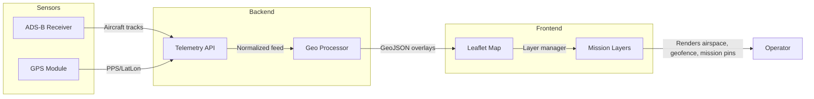
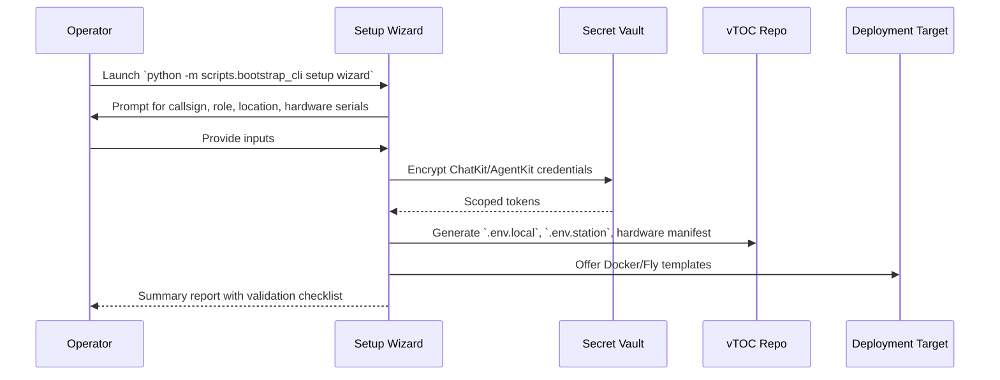

# vTOC Architecture Diagrams

The diagrams below complement the narrative found in [`docs/ARCHITECTURE.md`](ARCHITECTURE.md) and highlight how ChatKit and
AgentKit integrate with the platform.

## High-level topology

```
                       External Operators & Sensors
                                   │
                                   ▼
┌──────────────────────────────────────────────────────────────────────────┐
│                            ChatKit Organization                           │
│ ┌──────────────────────┐   ┌──────────────────────┐   ┌─────────────────┐ │
│ │ Ops Station Channel  │   │ Intel Station Channel│   │ Logistics Chan. │ │
│ └──────────┬───────────┘   └──────────┬───────────┘   └──────────┬──────┘ │
└────────────┼──────────────────────────┼───────────────────────────┼────────┘
             │                          │                           │
             ▼                          ▼                           ▼
      ┌────────────┐             ┌────────────┐               ┌────────────┐
      │ FastAPI    │◄────────────┤ Webhook    ├──────────────►│ AgentKit    │
      │ Backend    │  REST / WS  │ Router     │    Jobs        │ Control     │
      └─────┬──────┘             └─────┬──────┘               └────┬───────┘
            │                          │                           │
            │                          │                           │
            ▼                          │                           ▼
   ┌────────────────┐                  │                 ┌──────────────────┐
   │ Postgres       │◄─────────────────┴─────────────────┤ Telemetry Agents │
   │ station_ops    │    SQLAlchemy                      │ & Connectors     │
   │ station_intel  │                                   └──────────────────┘
   │ station_log    │
   └────────────────┘
            ▲
            │ REST
            ▼
   ┌────────────────────┐
   │ Vite/React Frontend│
   │ - Map overlays     │
   │ - Chat console     │
   │ - Station metrics  │
   └────────────────────┘
```

## Multi-station topology

```
┌────────────────────────────────────────────────────┐
│                 Postgres Instance                  │
│  ┌─────────────────────┬─────────────────────┬────┐│
│  │ vtoc_ops (DB + role)│ vtoc_intel          │ ...││
│  │ - ops_user          │ - intel_user        │    ││
│  │ - migrations        │ - migrations        │    ││
│  └──────────┬──────────┴──────────┬──────────┴────┘│
└─────────────┼─────────────────────┼────────────────┘
              │                     │
              │                     │
      ┌───────▼────────┐    ┌───────▼────────┐
      │ Ops Station    │    │ Intel Station  │
      │ Backend Pod    │    │ Backend Pod    │
      │ DATABASE_URL → │    │ DATABASE_URL → │
      │ vtoc_ops       │    │ vtoc_intel     │
      └───────┬────────┘    └───────┬────────┘
              │                     │
              ▼                     ▼
      ChatKit Channel         ChatKit Channel
      AgentKit Playbooks      AgentKit Playbooks
```

## ChatKit event flow

```
Operator message → ChatKit channel → Webhook (FastAPI) → AgentKit run →
Telemetry connector (optional) → Postgres event store → ChatKit thread update →
Frontend refresh
```

## Leaflet mission overlay



The Leaflet overlay pulls telemetry normalized by the backend and renders three default layers: **Airspace** (ADS-B),
**Geofence** (GPS), and **Mission pins** (AgentKit tasks). Review [`docs/ADSB.md`](ADSB.md) and [`docs/GPS.md`](GPS.md) for
hardware integration notes.

## Deployment pipeline

```
Developer commits → GitHub Actions (build/test) → GHCR images →
├── Docker Compose (make compose-up)
├── Docker Swarm (docker stack deploy)
└── Fly.io (git checkout live && flyctl deploy)
```

## Secrets lifecycle

```
make setup-local → prompt for ChatKit/AgentKit creds → write .env.local/.env.station
         │
         ├─ optional: Terraform renders secret manager references
         │
         └─ make setup-container --apply → inject secrets into generated compose file
```

## Hardware provisioning wizard



The wizard centralizes hardware onboarding and ensures the generated configuration references the deployment models
documented in [`docs/DEPLOYMENT.md`](DEPLOYMENT.md) and the troubleshooting steps in
[`docs/QUICKSTART.md#troubleshooting`](QUICKSTART.md#troubleshooting).

Refer back to [`docs/DEPLOYMENT.md`](DEPLOYMENT.md) for command examples and to [`docs/TELEMETRY_CONNECTORS.md`](TELEMETRY_CONNECTORS.md)
for connector-specific diagrams.
