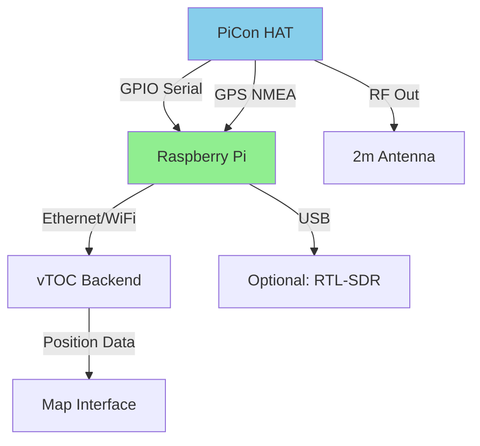
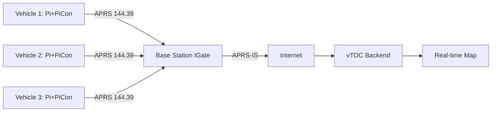

# BYONICS Micro-Fox PiCon

## Overview

The BYONICS Micro-Fox PiCon is an APRS (Automatic Packet Reporting System) tracker and transmitter designed for amateur radio operations. It integrates with Raspberry Pi for advanced tracking, telemetry reporting, and position broadcasting on amateur radio frequencies.

## Capabilities

- **APRS Transmission:** Broadcasts position reports on 144.39 MHz (US) or 144.80 MHz (EU)
- **Telemetry:** Temperature, voltage, and custom sensor data transmission
- **GPS Tracking:** Integrated GPS receiver with NMEA output
- **Fox Hunting:** Supports ARDF (Amateur Radio Direction Finding) mode
- **Messaging:** APRS messaging capability
- **Beacon Modes:**
  - Fixed interval (30s - 30min)
  - SmartBeaconing (speed/direction change based)
  - Corner pegging (high turn rate)
- **Power Levels:** 300mW, 500mW, 1W (adjustable)

## Power Requirements

- **Input Voltage:** 5-14V DC
- **Current Draw:**
  - Idle: 25-50 mA
  - GPS active: 50-80 mA  
  - Transmit (1W): 150-250 mA peak
- **Average Power:** 0.5-1W (typical beacon duty cycle)
- **Power Input:** 
  - Raspberry Pi GPIO header (5V regulated)
  - External barrel jack (5-14V)
  - JST battery connector
- **Battery Operation:**
  - 18650 Li-ion (3000mAh): 10-20 hours
  - USB power bank: 8-15 hours

## Hardware Specifications

| Parameter | Specification |
|-----------|--------------|
| Interface | Raspberry Pi GPIO 40-pin header |
| Transmitter | Si4463 ISM transceiver |
| Frequency | 70cm or 2m band (model dependent) |
| Output Power | 300mW / 500mW / 1W |
| GPS Chipset | U-blox 7 or 8 series |
| Antenna Connector | SMA female |
| Dimensions | 65mm × 56mm (HAT form factor) |
| Weight | ~35g (without antenna) |
| Operating Temperature | -20°C to +70°C |

## Deployment Notes

### Installation on Raspberry Pi

1. **Mount HAT on GPIO Header:**
   - Power off Raspberry Pi
   - Align 40-pin header carefully
   - Press firmly to seat connector
   - Secure with standoffs (M2.5 screws)

2. **Enable Serial Interface:**
   ```bash
   sudo raspi-config
   # Interface Options -> Serial Port
   # Login shell: NO
   # Serial hardware: YES
   sudo reboot
   ```

3. **Install APRS Software:**
   ```bash
   # Install Dire Wolf (APRS digipeater/tracker)
   sudo apt install direwolf
   
   # Or build from source for latest features
   git clone https://github.com/wb2osz/direwolf
   cd direwolf
   mkdir build && cd build
   cmake ..
   make -j4
   sudo make install
   ```

4. **Configure Dire Wolf:**
   ```bash
   # Edit config file
   nano ~/direwolf.conf
   ```
   
   Example configuration:
   ```
   ADEVICE null
   CHANNEL 0
   PTT GPIO 12
   MYCALL N0CALL-9
   MODEM 1200
   IGSERVER noam.aprs2.net
   IGLOGIN N0CALL-9 12345
   PBEACON delay=1 every=120 lat=42.5^N lon=71.2^W power=5 height=20 gain=3
   ```

### Amateur Radio License Requirement

⚠️ **Important:** Operating the PiCon requires a valid amateur radio license in your jurisdiction. Unlicensed transmission on amateur bands is illegal and subject to substantial fines.

- **US:** FCC Technician class or higher
- **EU:** CEPT license with APRS privileges
- **Callsign:** Must configure device with your assigned callsign
- **Frequency:** Use appropriate regional APRS frequency

### GPS Configuration

1. **Verify GPS device:**
   ```bash
   ls -l /dev/ttyAMA0  # or /dev/serial0
   ```

2. **Test GPS reception:**
   ```bash
   # Install GPS tools
   sudo apt install gpsd gpsd-clients
   
   # Monitor GPS output
   cgps -s
   ```

3. **Wait for fix:** Cold start can take 5-15 minutes with clear sky view

### Integration with vTOC

The PiCon can feed position data into vTOC through multiple paths:

#### Method 1: Direct Serial Parsing

```python
# Example: Read NMEA from PiCon GPS
import serial

ser = serial.Serial('/dev/ttyAMA0', 9600, timeout=1)
while True:
    line = ser.readline().decode('ascii', errors='ignore')
    if line.startswith('$GPGGA') or line.startswith('$GPRMC'):
        # Parse and forward to vTOC backend
        process_nmea(line)
```

#### Method 2: APRS-IS Gateway

Configure Dire Wolf to forward to APRS-IS, then scrape data from APRS.fi API:

```bash
# In direwolf.conf
IGSERVER rotate.aprs2.net
IGLOGIN N0CALL-9 <passcode>
```

Then in vTOC:
```python
import requests
# Query APRS.fi API for station positions
resp = requests.get('https://api.aprs.fi/api/get', params={
    'name': 'N0CALL-9',
    'what': 'loc',
    'apikey': '<your-key>',
    'format': 'json'
})
```

#### Method 3: Local APRS Receiver

Deploy a second station with RTL-SDR + Dire Wolf to receive PiCon transmissions directly:


## Recommended Antennas

### Mobile/Vehicle Use

- **Type:** 1/4 wave whip with magnetic mount
- **Frequency:** 144 MHz (2m band)
- **Gain:** 0-3 dBi
- **Mounting:** Vehicle roof (center preferred)
- **Cable:** RG-58 with SMA connector
- **Products:**
  - Diamond K400S (2m/70cm dual-band)
  - Larsen 2m NMO mount antenna

### Handheld/Portable

- **Type:** Flexible rubber duck
- **Frequency:** 144 MHz
- **Gain:** 0-2 dBi
- **Length:** 15-20 cm
- **Connector:** SMA male (direct mount)
- **Products:**
  - Nagoya NA-771 (2m/70cm)
  - Stock 2m whip antenna

### Fixed Station (High Altitude)

- **Type:** J-pole or 1/2 wave vertical
- **Frequency:** 144 MHz
- **Gain:** 3-6 dBi
- **Mounting:** Mast mount, 3-10m height
- **Cable:** LMR-400 for runs > 5m
- **Products:**
  - Ed Fong DBJ-1 roll-up J-pole
  - Arrow OSJ-146 (6dBi J-pole)

## Integration Diagrams

### Raspberry Pi Deployment



### Vehicle Tracking System



## Troubleshooting

### No GPS Lock

1. **Check antenna:** Ensure clear sky view (not indoors)
2. **Verify power:** GPS draws significant current, check 5V rail
3. **Wait for fix:** Cold start = 5-15 min, warm start = 30-60 sec
4. **Test with gpsmon:** `gpsmon /dev/ttyAMA0` to see raw data

### No APRS Transmission

1. **Check PTT GPIO:** Verify GPIO 12 (or configured pin) is working
   ```bash
   # Test GPIO toggle
   echo "12" > /sys/class/gpio/export
   echo "out" > /sys/class/gpio/gpio12/direction
   echo "1" > /sys/class/gpio/gpio12/value
   ```

2. **Verify serial communication:**
   ```bash
   # Monitor what PiCon receives
   cat /dev/ttyAMA0
   ```

3. **Test with beacon:**
   ```bash
   direwolf -t 0 -c direwolf.conf
   # Should show periodic beacon transmissions
   ```

4. **Check antenna:** Loose SMA connection = no RF output

### Received but Not on APRS.fi

1. **IGate coverage:** May need local IGate to reach APRS-IS
2. **Callsign formatting:** Must be valid SSID (e.g., N0CALL-9)
3. **APRS-IS login:** Verify passcode is correct for callsign
4. **Wait time:** APRS.fi updates every 30-60 seconds

## Best Practices

1. **License Compliance:**
   - Always transmit with valid callsign
   - Respect power limits for license class
   - Monitor frequency before transmitting (good practice)

2. **Power Management:**
   - Use quality power supply (2.5A minimum for Pi + PiCon)
   - Monitor voltage with `vcgencmd get_throttled`
   - Consider UPS/battery backup for mobile ops

3. **SmartBeaconing:**
   - Configure for activity pattern (vehicle vs. stationary)
   - Set minimum interval 60s to avoid saturation
   - Adjust turn threshold for vehicle dynamics

4. **Antenna Installation:**
   - Keep coax runs short (< 3m ideal)
   - Route away from power cables (noise)
   - Weatherproof all connections outdoors
   - Ground to vehicle chassis if mobile

5. **Testing:**
   - Test with RTL-SDR receiver before deployment
   - Verify coverage with local APRS network
   - Confirm position accuracy (GPS precision)
   - Log transmissions for debugging

6. **Operational Security:**
   - APRS is PUBLIC and unencrypted
   - Anyone can track your position
   - Consider operational OPSEC for sensitive missions
   - Use status text sparingly

## Related Documentation

- [GPS Integration](../GPS.md) - GPS configuration and troubleshooting
- [Hardware Overview](../HARDWARE.md) - Station hardware architecture
- [Raspberry Pi 5 Guide](RASPBERRY-PI-5.md) - Pi deployment guidance
- [Antenna Systems](ANTENNAS.md) - Antenna selection and installation

## External Resources

- [BYONICS PiCon Product Page](https://www.byonics.com/picon)
- [Dire Wolf APRS Software](https://github.com/wb2osz/direwolf)
- [APRS.fi Tracking Portal](https://aprs.fi/)
- [APRS Protocol Specification](http://www.aprs.org/doc/APRS101.PDF)
- [Amateur Radio License Information (US)](http://www.arrl.org/getting-your-technician-license)
