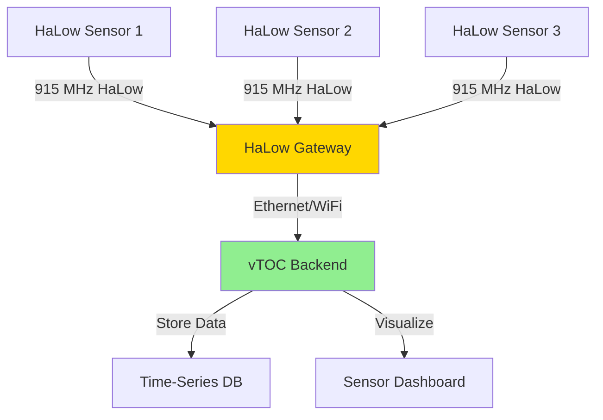
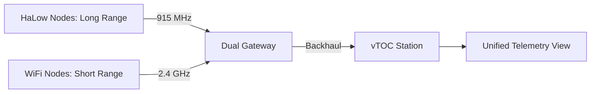

# Heltec HaLow ESP32 Dev Board (915 MHz)

## Overview

The Heltec HaLow ESP32 Development Board integrates WiFi HaLow (IEEE 802.11ah) technology with the ESP32 microcontroller platform. WiFi HaLow operates in the sub-1 GHz ISM band (915 MHz for US), providing extended range (up to 1 km) and improved penetration compared to traditional 2.4/5 GHz WiFi, making it ideal for IoT and long-range telemetry applications.

## Capabilities

- **WiFi HaLow (802.11ah):** Sub-GHz long-range WiFi
- **Range:** Up to 1 km line-of-sight (300-500m in urban)
- **Data Rate:** 150 kbps to 7.8 Mbps (MCS0-MCS10)
- **Power Efficiency:** 10x lower power than conventional WiFi
- **ESP32 Integration:** Dual-core processor for application logic
- **IP Connectivity:** Standard TCP/IP stack
- **Mesh Networking:** Support for mesh topologies (vendor-specific)
- **Concurrent Operation:** HaLow + BLE/WiFi 2.4 GHz (chip dependent)

## Power Requirements

- **Input Voltage:** 5V USB or 3.7V Li-ion battery
- **Current Draw:**
  - Deep sleep: 0.01-0.1 mA
  - Idle (HaLow connected): 15-30 mA
  - HaLow RX: 30-60 mA
  - HaLow TX (max): 100-200 mA
  - ESP32 active: 80-160 mA
- **Average Power:** 150-300 mA (active use)
- **Power Consumption:** 0.75-1.5W typical
- **Battery Life:**
  - 3000mAh battery: 10-20 hours continuous
  - With duty cycling: 48-96 hours
- **Power Input:** USB-C or JST battery connector

## Hardware Specifications

| Parameter | Specification |
|-----------|--------------|
| Microcontroller | ESP32 dual-core (240 MHz) |
| HaLow Radio | 802.11ah transceiver (915 MHz US) |
| WiFi (Optional) | 802.11 b/g/n (2.4 GHz, ESP32 native) |
| Bluetooth | BLE 4.2 / 5.0 |
| Frequency | 902-928 MHz (US ISM band) |
| TX Power | Up to 20 dBm (100 mW) |
| RX Sensitivity | -98 dBm typical |
| Data Rate | 150 kbps to 7.8 Mbps |
| Antenna Connector | U.FL/IPEX for HaLow, 2.4 GHz |
| Display | 0.96" OLED (128×64, I2C) |
| GPIO | Standard ESP32 pinout |
| USB | USB-C (programming + power) |
| Dimensions | 51mm × 25mm × 10mm |
| Weight | ~15g |
| Operating Temperature | -10°C to +50°C |

## Deployment Notes

### Firmware Setup

Heltec provides Arduino and ESP-IDF libraries for the HaLow module:

```bash
# Install Arduino IDE + ESP32 board support
# Add Heltec board URL to Arduino preferences
https://github.com/Heltec-Aaron-Lee/WiFi_Kit_series/releases/download/0.0.7/package_heltec_esp32_index.json

# Install Heltec ESP32 boards
# Select: Tools -> Board -> Heltec WiFi Kit 32 (or specific HaLow variant)

# Install HaLow library
git clone https://github.com/Heltec-Aaron-Lee/Heltec_HaLow
# Copy to Arduino/libraries/
```

Example sketch for HaLow AP connection:

```cpp
#include "heltec.h"
#include "HaLow.h"

const char* ssid = "HaLow-Gateway-SSID";
const char* password = "your-password";

void setup() {
    Serial.begin(115200);
    
    // Initialize HaLow radio
    HaLow.begin();
    
    // Connect to HaLow access point
    HaLow.connect(ssid, password);
    
    while (HaLow.status() != HALOW_CONNECTED) {
        delay(500);
        Serial.print(".");
    }
    
    Serial.println("\nHaLow Connected!");
    Serial.print("IP: ");
    Serial.println(HaLow.localIP());
}

void loop() {
    // Send telemetry data over HaLow
    if (HaLow.status() == HALOW_CONNECTED) {
        sendTelemetry();
    }
    delay(30000); // 30 second interval
}
```

### HaLow Network Configuration

#### Station Mode (Client)

```cpp
// Connect to HaLow gateway
HaLow.begin();
HaLow.setMode(HALOW_STA);
HaLow.connect("GATEWAY-SSID", "password");
```

#### Access Point Mode

```cpp
// Create HaLow hotspot
HaLow.begin();
HaLow.setMode(HALOW_AP);
HaLow.softAP("SENSOR-NODE-001", "password");
HaLow.softAPConfig(
    IPAddress(192, 168, 4, 1),    // Local IP
    IPAddress(192, 168, 4, 1),    // Gateway
    IPAddress(255, 255, 255, 0)   // Subnet
);
```

### Integration with vTOC

The HaLow ESP32 can feed telemetry to vTOC over IP:

#### Method 1: HTTP POST to vTOC API

```cpp
#include <HTTPClient.h>

void sendTelemetry() {
    HTTPClient http;
    
    // Build JSON payload
    String payload = "{";
    payload += "\"device_id\":\"HALOW-001\",";
    payload += "\"temperature\":" + String(readTemperature()) + ",";
    payload += "\"humidity\":" + String(readHumidity()) + ",";
    payload += "\"battery\":" + String(readBatteryVoltage());
    payload += "}";
    
    // POST to vTOC
    http.begin("http://vtoc-station.local/api/telemetry/sensor");
    http.addHeader("Content-Type", "application/json");
    http.addHeader("Authorization", "Bearer <token>");
    
    int httpCode = http.POST(payload);
    
    if (httpCode == 200) {
        Serial.println("Telemetry sent successfully");
    } else {
        Serial.printf("HTTP error: %d\n", httpCode);
    }
    
    http.end();
}
```

#### Method 2: MQTT over HaLow

```cpp
#include <PubSubClient.h>

WiFiClient halowClient;
PubSubClient mqtt(halowClient);

void setup() {
    // ... HaLow connection code ...
    
    mqtt.setServer("mqtt.vtoc.local", 1883);
    mqtt.connect("HALOW-001", "user", "pass");
}

void loop() {
    if (mqtt.connected()) {
        // Publish sensor data
        String topic = "vtoc/sensors/HALOW-001";
        String payload = "{\"temp\":22.5,\"humidity\":45}";
        mqtt.publish(topic.c_str(), payload.c_str());
    }
    delay(60000);
}
```

#### Method 3: UDP Streaming

For low-latency position updates:

```cpp
#include <WiFiUdp.h>

WiFiUDP udp;

void sendPosition(float lat, float lon) {
    char buffer[128];
    snprintf(buffer, sizeof(buffer), 
             "HALOW-001,%.6f,%.6f,%d", 
             lat, lon, millis());
    
    udp.beginPacket("vtoc-station.local", 5555);
    udp.write((uint8_t*)buffer, strlen(buffer));
    udp.endPacket();
}
```

### Deployment Scenarios

#### Scenario 1: Agricultural Sensor Network

- Deploy HaLow nodes in fields (soil moisture, temp)
- Range: 500m-1km between nodes
- Gateway at farmhouse connects to vTOC
- Low power: Solar + battery for season-long operation

#### Scenario 2: Parking Lot Occupancy

- HaLow sensors detect parking space occupancy
- Range advantage: Cover large lot with 1-2 gateways
- Real-time updates to vTOC parking map layer
- Power: Wired or long-life battery (monthly change)

#### Scenario 3: Remote Environmental Monitoring

- Weather stations in remote locations
- HaLow bridges data back to vTOC station
- Extended range reduces gateway count
- Mesh mode: Nodes relay for others out of range

## Recommended Antennas

### HaLow (915 MHz)

- **Type:** 1/4 wave whip or dipole
- **Gain:** 0-5 dBi
- **Connector:** U.FL/IPEX to RP-SMA pigtail
- **Mounting:** Vertical orientation for omnidirectional
- **Products:**
  - 915 MHz 3dBi whip antenna
  - 900 MHz 5dBi outdoor dipole
  - Directional: 10 dBi Yagi for point-to-point

### 2.4 GHz WiFi (if using ESP32 WiFi)

- **Type:** PCB antenna (onboard) or external
- **Gain:** 2-3 dBi
- **Mounting:** Keep clear of metal obstructions
- **Use Case:** Local configuration, fallback connectivity

## Integration Diagrams

### Sensor Network Architecture



### Mixed WiFi + HaLow Deployment



## Troubleshooting

### HaLow Connection Fails

1. **Frequency band:** Verify gateway and node use same channel
2. **Antenna:** HaLow antenna must be connected (U.FL connector)
3. **Range:** Start testing at close range (< 10m) then move apart
4. **Encryption:** Check WPA2/WPA3 settings match
5. **Gateway capacity:** Some HaLow APs limit concurrent connections

### Short Range / Weak Signal

1. **Antenna quality:** Cheap antennas have poor performance
2. **Antenna height:** Raise above ground clutter (1-3m)
3. **Obstructions:** Sub-GHz is better than 2.4 GHz but not magic
4. **TX power:** Increase to 20 dBm if legal in region
5. **Interference:** Check for other 915 MHz devices (LoRa, ISM)

### High Power Consumption

1. **Polling frequency:** Reduce from 10s to 60s intervals
2. **Deep sleep:** Use ESP32 deep sleep between transmissions
3. **HaLow radio:** Configure power-save mode (PSM)
4. **OLED display:** Disable if not needed (draws 10-20 mA)

### Data Loss / Packet Drops

1. **Range:** Beyond reliable range, packet loss increases
2. **Retry logic:** Implement application-level ACKs
3. **Buffer overflow:** Check gateway can handle data rate
4. **Mesh routing:** Enable multi-hop if supported

## Best Practices

1. **Network Planning:**
   - Survey with spectrum analyzer (915 MHz band)
   - Plan for 50% range margin (rated vs. actual)
   - Use link budget calculator for deployments
   - Test at deployment site before finalizing

2. **Power Optimization:**
   - Deep sleep ESP32 between readings (saves 90% power)
   - Use HaLow power-save mode (TIM beacon wake)
   - Disable WiFi 2.4 GHz if not needed
   - Solar: 5W panel + 10Ah battery = indefinite

3. **Antenna Selection:**
   - Omnidirectional: General sensor networks
   - Directional: Point-to-point links (extends range 2-5x)
   - Mounting: Vertical for omni, horizontal for Yagi
   - Cable loss: Keep < 1m or use LMR-400

4. **Security:**
   - Always use WPA2/WPA3 encryption
   - Change default passwords (critical!)
   - Segment HaLow network from production
   - Use VPN for internet backhaul (if applicable)

5. **Environmental:**
   - IP65+ enclosure for outdoor deployment
   - Seal antenna cable entry with silicone
   - Desiccant packet in humid environments
   - Temperature-rated components (-20 to +60°C)

6. **Testing:**
   - Walk test: Carry node, monitor RSSI vs. distance
   - Throughput test: iperf3 over HaLow
   - Battery test: Measure runtime with target interval
   - Failover: Verify recovery after power loss

## WiFi HaLow Advantages

| Feature | WiFi (2.4/5 GHz) | WiFi HaLow (Sub-1 GHz) |
|---------|------------------|------------------------|
| **Range** | 50-100m | 500-1000m |
| **Penetration** | Poor through walls | Good through walls |
| **Power** | 100-300 mA typical | 30-100 mA typical |
| **Data Rate** | 54-600 Mbps | 0.15-7.8 Mbps |
| **Interference** | High (crowded band) | Low (ISM band) |
| **Use Case** | High bandwidth | IoT, sensors, long-range |

## Related Documentation

- [WiFi HaLow Bridge Kit](WIFI-HALOW-BRIDGE.md) - HaLow gateway/bridge
- [LoRa MANET Node](LORA-MANET.md) - Alternative sub-GHz mesh
- [Geospatial Mesh Planning](../MESH_PLANNING/OVERVIEW.md) - Coverage planning
- [Hardware Overview](../HARDWARE.md) - Station hardware architecture

## External Resources

- [Heltec WiFi HaLow Documentation](https://heltec.org/project/wifi-halow/)
- [IEEE 802.11ah Standard](https://standards.ieee.org/standard/802_11ah-2016.html)
- [WiFi HaLow Alliance](https://www.wi-fi.org/discover-wi-fi/wi-fi-halow)
- [Sub-1 GHz ISM Band Regulations](https://www.fcc.gov/wireless/bureau-divisions/mobility-division/broadband-division/900-mhz)
