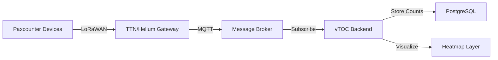
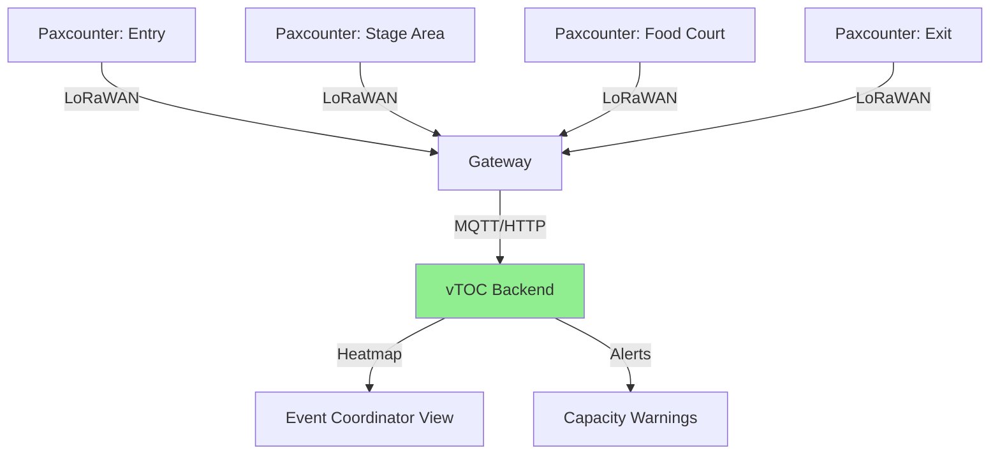
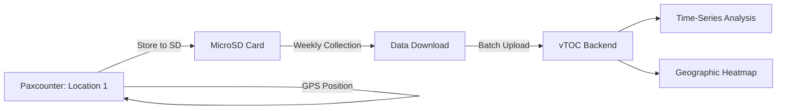

# LiLIGO ESP32 TTGO Paxcounter

## Overview

The LiLIGO TTGO T-Beam (Paxcounter variant) is an ESP32-based device designed for counting WiFi and Bluetooth devices anonymously. It's used in vTOC deployments for crowd density monitoring, foot traffic analysis, and anonymous presence detection without collecting personal data.

## Capabilities

- **WiFi Scanning:** Detects 2.4 GHz WiFi probe requests and beacons
- **Bluetooth Scanning:** BLE advertisement detection  
- **Anonymous Counting:** MAC address hashing (no PII stored)
- **GPS Logging:** Position-stamped counts for spatial analysis
- **LoRa Uplink:** Transmit counts to gateway (no WiFi/cellular needed)
- **Local Storage:** MicroSD card for offline data logging
- **Display:** OLED screen shows real-time count
- **Battery Operation:** 8-24 hours continuous (battery dependent)
- **Open Source:** Fully customizable firmware (ESP-IDF/Arduino)

## Power Requirements

- **Input Voltage:** 5V USB or 3.7V Li-ion battery
- **Current Draw:**
  - Idle (WiFi/BT off): 10-15 mA
  - WiFi scanning: 80-120 mA
  - BT scanning: 40-60 mA
  - LoRa transmit: 100-150 mA peak
  - GPS active: 25-40 mA
  - OLED display: 10-20 mA
- **Average Power:** 150-250 mA (all features active)
- **Power Consumption:** 0.75-1.25W typical
- **Battery Connector:** JST-PH 2.0mm
- **Charging:** USB-C (5V/1A), onboard LiPo charger
- **Battery Life:**
  - 3000mAh 18650: 12-20 hours
  - 5000mAh external: 20-30 hours

## Hardware Specifications

| Parameter | Specification |
|-----------|--------------|
| Microcontroller | ESP32 dual-core (240 MHz) |
| WiFi | 802.11 b/g/n (2.4 GHz) |
| Bluetooth | BLE 4.2, 5.0 (model dependent) |
| LoRa Radio | SX1276/SX1278 (433/868/915 MHz) |
| GPS | NEO-6M or NEO-8M (variant dependent) |
| Display | 0.96" OLED (128×64, I2C) |
| Storage | MicroSD card slot (SPI) |
| Sensors | Optional: BME280 (temp/humidity/pressure) |
| Antenna Connectors | U.FL/IPEX for LoRa, GPS |
| USB | USB-C (programming + power) |
| Dimensions | 115mm × 28mm × 15mm |
| Weight | ~50g (with battery holder) |
| Operating Temperature | -10°C to +50°C |

## Deployment Notes

### Firmware Installation

The Paxcounter firmware by cyberman54 is the standard for this use case:

```bash
# Install ESP-IDF tools
sudo apt install git python3 python3-pip python3-venv
pip3 install esptool

# Clone Paxcounter firmware
git clone https://github.com/cyberman54/ESP32-Paxcounter
cd ESP32-Paxcounter

# Configure for TTGO T-Beam
cp platformio_orig.ini platformio.ini
# Edit platformio.ini, uncomment "ttgobeam" board

# Build and flash
pip3 install platformio
pio run -e ttgobeam -t upload
```

### Configuration

Edit `src/paxcounter.conf`:

```cpp
#define VENDORFILTER 1          // Enable MAC vendor filtering
#define BLECOUNTER 1            // Count Bluetooth devices
#define WIFICOUNTER 1           // Count WiFi devices  
#define COUNTERMODE 0           // 0=cyclic, 1=cumulative
#define SENDCYCLE 120           // Send data every 120 seconds
#define MACFILTER 0             // Don't filter randomized MACs
#define RSSILIMIT 0             // No RSSI threshold (count all)

// LoRa configuration
#define LORADRDEFAULT 5         // Data rate (SF7)
#define ADR 1                   // Adaptive data rate
#define LORAWAN_CONFIRMED 0     // Unconfirmed uplinks (faster)

// GPS configuration  
#define GPS_SERIAL 9600         // NEO-6M baud rate
```

### LoRaWAN Provisioning (if using TTN/Helium)

```bash
# Connect via serial monitor
screen /dev/ttyUSB0 115200

# Configure LoRaWAN credentials
set deveui <device-eui>
set appeui <application-eui>
set appkey <app-key>
set join otaa
```

Alternatively, hardcode in `src/lorawan.cpp` for fleet deployment.

### Standalone Mode (No LoRaWAN)

For deployments without LoRaWAN coverage, use local storage:

```cpp
// Enable SD card logging
#define HAS_SDCARD 1

// Data format: CSV
// timestamp,latitude,longitude,wifi_count,ble_count
```

Retrieve data via USB serial or read MicroSD card post-deployment.

### Integration with vTOC

#### Option 1: LoRaWAN → MQTT Bridge



Example Node-RED flow (MQTT to vTOC):

```javascript
// Parse LoRaWAN payload
const payload = Buffer.from(msg.payload, 'base64');
const wifi_count = payload.readUInt16BE(0);
const ble_count = payload.readUInt16BE(2);
const lat = payload.readInt32BE(4) / 1e7;
const lon = payload.readInt32BE(8) / 1e7;

// POST to vTOC API
msg.url = 'https://vtoc.example.com/api/telemetry/paxcounter';
msg.payload = {
    device_id: msg.metadata.device_id,
    timestamp: new Date().toISOString(),
    latitude: lat,
    longitude: lon,
    wifi_count: wifi_count,
    ble_count: ble_count
};
return msg;
```

#### Option 2: Serial/USB Data Collection

For fixed installations connected to vTOC station:

```python
import serial
import json
import requests

ser = serial.Serial('/dev/ttyUSB0', 115200)

while True:
    line = ser.readline().decode('utf-8').strip()
    if line.startswith('PAX:'):
        # Parse: PAX: WiFi=42 BLE=18 Lat=42.3601 Lon=-71.0589
        parts = line.split()
        data = {
            'device_id': 'PAXCOUNTER-001',
            'timestamp': datetime.now().isoformat(),
            'wifi_count': int(parts[1].split('=')[1]),
            'ble_count': int(parts[2].split('=')[1]),
            'latitude': float(parts[3].split('=')[1]),
            'longitude': float(parts[4].split('=')[1])
        }
        
        # Post to vTOC
        requests.post('https://vtoc.local/api/telemetry/paxcounter', json=data)
```

#### Option 3: Batch Upload from SD Card

For periodic collection:

```python
import pandas as pd
import requests

# Read CSV from MicroSD
df = pd.read_csv('/mnt/sdcard/paxcounter_20241116.csv')

# Batch upload to vTOC
for _, row in df.iterrows():
    payload = {
        'device_id': 'PAXCOUNTER-002',
        'timestamp': row['timestamp'],
        'latitude': row['latitude'],
        'longitude': row['longitude'],
        'wifi_count': row['wifi_count'],
        'ble_count': row['ble_count']
    }
    requests.post('https://vtoc.local/api/telemetry/paxcounter', json=payload)
```

### Deployment Scenarios

#### Scenario 1: Event Crowd Monitoring

- Deploy 5-10 Paxcounters around event perimeter
- LoRaWAN uplink every 60-120 seconds
- vTOC displays heatmap of crowd density
- Alerts when zone exceeds capacity threshold
- Data used for egress planning

#### Scenario 2: Urban Foot Traffic Analysis

- Fixed installation at street corners
- Solar panel + battery for continuous operation
- Count trends by hour/day/week
- Identify high-traffic areas for resource allocation
- Anonymous (complies with privacy regulations)

#### Scenario 3: Search Area Coverage

- Portable units carried by search teams
- Log WiFi/BLE signatures of missing person's devices
- GPS tracks search pattern + device detection zones
- Upload data for analysis of search effectiveness
- Heatmap shows coverage gaps

## Recommended Antennas

### LoRa (915 MHz / 868 MHz / 433 MHz)

- **Type:** 1/4 wave whip or stubby
- **Gain:** 0-3 dBi
- **Connector:** U.FL/IPEX to RP-SMA pigtail
- **Mounting:** External antenna for better range
- **Products:**
  - 915 MHz 2dBi stubby antenna
  - 868/915 MHz 3dBi whip

### GPS

- **Type:** Active patch antenna
- **Gain:** 28 dBi typical
- **Connector:** U.FL/IPEX ceramic antenna (stock) or external
- **Mounting:** Flat with sky view (not inside metal case)
- **Products:**
  - NEO-6M/8M ceramic patch (included)
  - External active GPS antenna for enclosed deployments

## Integration Diagrams

### Event Monitoring Deployment



### Fixed Installation Architecture



## Troubleshooting

### Low Device Count

1. **Antenna:** Ensure LoRa/WiFi antennas connected (device won't count without)
2. **RSSI threshold:** Set RSSILIMIT=0 to count all devices
3. **Scan time:** Increase dwell time (WiFi channel scan duration)
4. **Location:** Placement affects detection (higher = more coverage)
5. **MAC randomization:** Modern phones randomize MAC (expect lower counts)

### GPS Not Locking

1. **Antenna:** Stock ceramic antenna requires clear sky view
2. **Metal enclosure:** Move GPS antenna outside of case
3. **Cold start:** Wait 5-15 minutes outdoors
4. **Verify baudrate:** NEO-6M uses 9600, NEO-8M can use 115200

### LoRaWAN Join Failed

1. **Credentials:** Verify DEVEUI, APPEUI, APPKEY are correct
2. **Frequency plan:** Must match region (US915, EU868, etc.)
3. **Gateway coverage:** Check TTN/Helium mapper for coverage
4. **Antenna:** LoRa antenna must be connected (U.FL connector fragile)

### High Power Consumption

1. **Disable GPS:** If position not needed, GPS draws significant power
2. **Reduce display:** OLED uses power, set auto-off timeout
3. **Increase TX interval:** Transmit every 5-10 minutes vs. 1 minute
4. **WiFi power:** Reduce TX power if dense environment

## Best Practices

1. **Privacy Compliance:**
   - Enable MAC hashing (anonymize addresses)
   - Don't store raw MAC addresses (illegal in many jurisdictions)
   - Post signage if legally required ("Device counting active")
   - Retain only aggregate counts, not individual traces

2. **Placement:**
   - Height: 1.5-3 meters for human-level devices
   - Orientation: Vertical (OLED facing down sheds rain)
   - Avoid metal obstructions
   - Test coverage area before permanent install

3. **Power Management:**
   - Solar panel (5W) + 10Ah battery = indefinite operation
   - Deep sleep between scans (wake every 30s)
   - Use power bank for temporary deployments (< 1 week)

4. **Data Quality:**
   - Calibrate counts (correlate with manual counts)
   - Filter duplicates (same device seen repeatedly)
   - Account for MAC randomization (Apple, Android 10+)
   - Trend analysis more valuable than absolute numbers

5. **Enclosure:**
   - IP65 minimum for outdoor use
   - Waterproof USB-C port (silicone plug)
   - Ventilation holes for heat (but maintain IP rating)
   - Clear window for OLED (optional)

6. **Maintenance:**
   - Check battery voltage monthly (< 3.2V = replace)
   - Clean antennas (dust/dirt reduces range)
   - Download SD card data quarterly (prevent overflow)
   - Update firmware annually (security patches)

## Related Documentation

- [LoRa MANET Node](LORA-MANET.md) - LoRa mesh networking
- [Geospatial Mesh Planning](../MESH_PLANNING/OVERVIEW.md) - Coverage planning
- [Hardware Overview](../HARDWARE.md) - Station hardware architecture
- [Deployment Guide](../DEPLOYMENT.md) - Production deployment procedures

## External Resources

- [ESP32-Paxcounter GitHub](https://github.com/cyberman54/ESP32-Paxcounter)
- [TTGO T-Beam Documentation](https://github.com/LilyGO/TTGO-T-Beam)
- [The Things Network](https://www.thethingsnetwork.org/)
- [LoRaWAN Regional Parameters](https://lora-alliance.org/resource_hub/rp2-1-0-3-lorawan-regional-parameters/)
