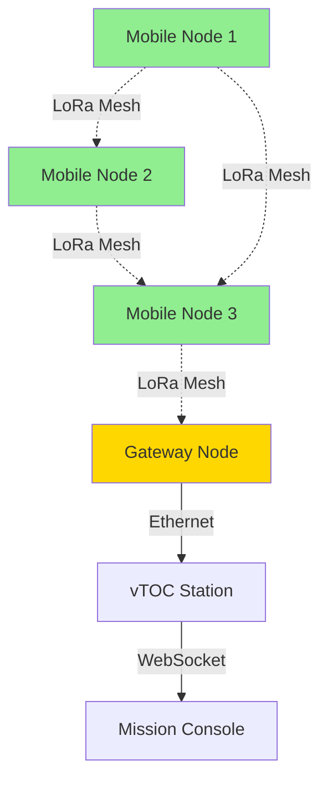
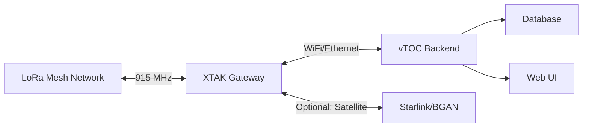

# LoRa-MANET Node (MorosX XTAK)

## Overview

The MorosX XTAK LoRa Mesh device provides mobile ad-hoc networking (MANET) capabilities using LoRa modulation. It enables long-range, low-power mesh communications for tactical operations where traditional infrastructure is unavailable or unreliable.

**Product Link:** [MorosX XTAK LoRa Mesh](https://morosx.com/ols/products/xtak-lora-mesh)

## Capabilities

- **Mesh Networking:** Self-healing, multi-hop MANET topology
- **Range:** Up to 10 km line-of-sight (urban: 2-5 km)
- **Data Rate:** 0.3 - 37.5 kbps (LoRa spreading factor dependent)
- **Frequency Bands:** 
  - 433 MHz (EU/Asia)
  - 868 MHz (EU)
  - 915 MHz (US/Americas)
- **Network Capacity:** Up to 200 nodes per mesh
- **Latency:** 50-500ms typical (depends on hop count)
- **Encryption:** AES-256 for data security
- **Applications:**
  - Position reporting (GPS tracking)
  - Text messaging
  - Sensor telemetry relay
  - Emergency communications
  - Distributed command and control

## Power Requirements

- **Input Voltage:** 5-12V DC
- **Current Draw:** 
  - Idle: ~50-100 mA
  - Transmit (max): ~150-200 mA
  - Receive: ~30-50 mA
- **Average Power:** 0.5-1.5W (duty cycle dependent)
- **Power Input:** Barrel jack (2.1mm) or JST connector
- **Battery Operation:** 
  - 18650 Li-ion (3000mAh): 20-40 hours typical
  - LiPo (5000mAh): 30-60 hours typical

## Hardware Specifications

| Parameter | Specification |
|-----------|--------------|
| Processor | ESP32 or STM32 (model dependent) |
| LoRa Chipset | SX1276/SX1278 |
| GPS | Integrated U-blox or similar |
| Antenna Connector | RP-SMA female |
| Interfaces | USB-C (config/power), UART, I2C |
| Display | OLED (0.96" or 1.3") |
| Dimensions | ~80mm × 50mm × 25mm |
| Weight | ~60-80g (without battery) |
| Enclosure | IP54-rated (splash-proof) |
| Operating Temperature | -10°C to +50°C |

## Deployment Notes

### Initial Configuration

1. **Connect via USB:**
   ```bash
   # Linux: Device appears as /dev/ttyUSB0 or /dev/ttyACM0
   screen /dev/ttyUSB0 115200
   # Or use serial terminal: minicom, putty, etc.
   ```

2. **Configure Mesh Parameters:**
   - Set frequency band (915 MHz for US)
   - Configure spreading factor (SF7-SF12, lower = faster/shorter range)
   - Set bandwidth (125/250/500 kHz)
   - Configure network ID (isolate mesh from others)
   - Enable GPS tracking if integrated

3. **Web Interface (if available):**
   - Some models provide WiFi AP mode for web-based configuration
   - Connect to device AP: `XTAK-XXXXXX`
   - Navigate to: `http://192.168.4.1`

### Network Topology Planning

- **Star Network:** 1 gateway node, multiple edge nodes (range limited)
- **Mesh Network:** All nodes relay traffic (recommended for vTOC)
- **Hybrid:** Gateway nodes with dual radios (LoRa + WiFi/Ethernet)

### Integration with vTOC

#### Option 1: Serial Bridge

```bash
# Read NMEA sentences from LoRa node
cat /dev/ttyUSB0 | grep -E '^\$GP|^\$GL'
```

Configure AgentKit connector to parse position reports:

```python
# Example connector configuration
connector_config = {
    "type": "serial",
    "port": "/dev/ttyUSB0",
    "baudrate": 115200,
    "parser": "nmea_gps_lora"
}
```

#### Option 2: UDP Gateway Mode

Some XTAK models support transparent UDP bridging:

```bash
# Configure XTAK to forward to vTOC backend
# In XTAK config:
UDP_HOST=<vtoc-station-ip>
UDP_PORT=5555
```

Then configure backend to receive mesh telemetry on UDP port.

#### Option 3: MQTT Bridge

For advanced deployments, use MQTT gateway:


### Deployment Scenarios

#### Scenario 1: Vehicle Tracking

- Mount XTAK in each vehicle with GPS enabled
- Configure position reporting interval (30-60 seconds)
- Gateway node at TOC with Ethernet backhaul to vTOC
- Map visualization via Leaflet interface

#### Scenario 2: Personnel Tracking

- Handheld XTAK units in ruggedized cases
- Battery-powered operation (8-12 hour shifts)
- Text messaging between units and TOC
- Panic button integration

#### Scenario 3: Sensor Network

- XTAK nodes with environmental sensors (temp, humidity, etc.)
- Low-power mode (SF12, long intervals)
- Data relay through mesh to gateway
- Alerts triggered by threshold violations

## Recommended Antennas

### Fixed Installation (Base Station)

- **Type:** 1/2 wave collinear vertical
- **Gain:** 5-9 dBi
- **Polarization:** Vertical
- **Mounting:** Roof/mast mount, 3-10m height
- **Cable:** LMR-400 for long runs (>10m)
- **Products:**
  - 915 MHz 5dBi fiberglass omni
  - 868/915 MHz 9dBi collinear

### Mobile/Portable

- **Type:** 1/4 wave whip or helical
- **Gain:** 0-3 dBi
- **Mounting:** Magnetic vehicle mount or belt clip
- **Cable:** RG-174 or RG-58 (short runs < 1m)
- **Products:**
  - 915 MHz 3dBi stubby antenna
  - 868/915 MHz flexible whip

### Directional (Point-to-Point)

- **Type:** Yagi or patch antenna
- **Gain:** 10-15 dBi
- **Beamwidth:** 30-60 degrees
- **Use Case:** Extended range links, fixed backhaul
- **Mounting:** Aimed at specific remote node

## Integration Diagrams

### Basic Mesh Deployment



### Dual-Radio Gateway



## Troubleshooting

### No Communication Between Nodes

1. **Verify frequency band match:** All nodes must use same frequency
2. **Check spreading factor:** Higher SF = longer range but slower
3. **Confirm network ID:** Nodes must share same mesh ID
4. **Test LOS:** Move to open area to rule out obstruction
5. **Antenna connection:** Ensure RP-SMA connector is tight

### Short Range / Weak Signal

1. **Increase transmit power:** Configure to max allowed (check local regulations)
2. **Upgrade antenna:** Replace stock antenna with higher gain
3. **Reduce interference:** Avoid USB 3.0 devices, power supplies near antenna
4. **Check VSWR:** Poor antenna match reduces range
5. **Raise antenna height:** Each meter helps with ground clutter

### High Latency

1. **Reduce hop count:** Add intermediate relay nodes
2. **Lower spreading factor:** SF7 is fastest (but shortest range)
3. **Increase bandwidth:** 250 or 500 kHz (reduces range slightly)
4. **Optimize routing:** Some meshes support manual route pinning

### GPS Not Locking

1. **Clear sky view:** GPS requires open sky (no indoor use)
2. **Wait for cold start:** Initial lock can take 5-15 minutes
3. **Check GPS enable:** Verify GPS is enabled in config
4. **Antenna issue:** Some models require external GPS antenna

## Best Practices

1. **Antenna Height:** Every meter of elevation significantly improves range
   - Vehicle: Roof-mounted magnetic base
   - Fixed: Mast mount 3-6m minimum
   - Handheld: Extend whip fully, keep vertical

2. **Battery Management:**
   - Use quality Li-ion or LiPo batteries
   - Enable low-power modes during idle
   - Carry spare batteries for field operations
   - Monitor voltage with OLED display

3. **Network Planning:**
   - Map deployment area for LOS analysis
   - Place gateway at highest/central point
   - Plan for at least 1 backup gateway
   - Test with field survey before mission

4. **Frequency Coordination:**
   - Verify ISM band regulations for region
   - Check for other LoRa users (LoRaWAN, etc.)
   - Document frequency settings in runbook

5. **Security:**
   - Always enable AES encryption
   - Use unique network IDs per deployment
   - Rotate keys periodically (if supported)
   - Disable unused interfaces (WiFi AP)

6. **Environmental Protection:**
   - Use IP-rated enclosures for outdoor nodes
   - Seal cable entries with silicone
   - Add desiccant packets in humid environments
   - Regular inspection quarterly

## Related Documentation

- [Geospatial Mesh Network Planner](../MESH_PLANNING/OVERVIEW.md) - Network planning tools
- [Antenna Systems](ANTENNAS.md) - Antenna selection and construction
- [Hardware Overview](../HARDWARE.md) - Station hardware architecture
- [RF Implementation Status](../RF/IMPLEMENTATION-STATUS.md) - RF capabilities roadmap

## External Resources

- [MorosX XTAK Product Page](https://morosx.com/ols/products/xtak-lora-mesh)
- [LoRa Range Calculator](https://www.loratools.nl/#/airtime)
- [Meshtastic Firmware](https://meshtastic.org/) - Alternative open-source firmware
- [RadioMobile Online](https://www.ve2dbe.com/rmonline_s.asp) - Radio propagation modeling
