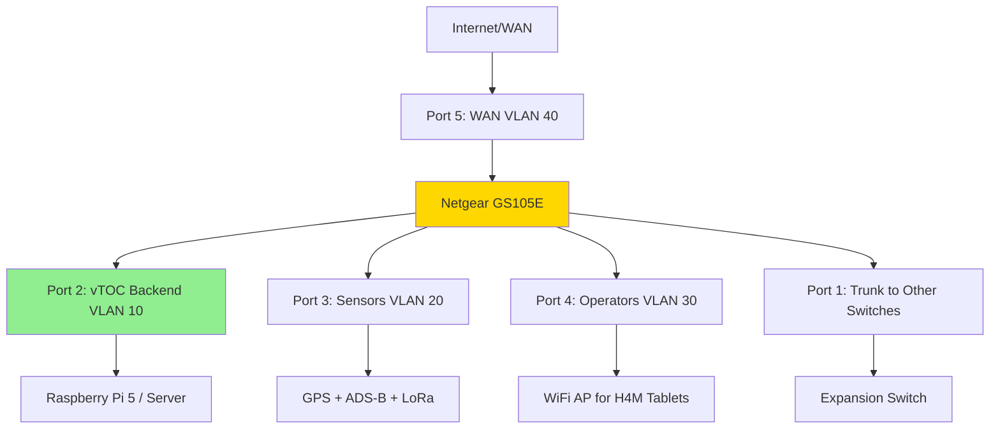

# Netgear GS105E Managed Switch

## Overview

The Netgear GS105E is a 5-port Gigabit managed switch that provides essential network management features in a compact, fanless design. It's ideal for vTOC station deployments where VLAN segmentation, QoS, and port mirroring are needed without the complexity and cost of enterprise switches.

## Capabilities

- **Ports:** 5× 10/100/1000 Mbps Gigabit Ethernet
- **Management:** Web-based interface, VLAN, QoS
- **VLANs:** 802.1Q VLAN tagging (up to 64 VLANs)
- **QoS:** 802.1p priority-based traffic shaping
- **Port Mirroring:** Monitor traffic for debugging
- **IGMP Snooping:** Optimize multicast traffic
- **Jumbo Frames:** Support up to 9K MTU
- **Fanless:** Silent operation (0 dB)
- **Energy Efficient:** IEEE 802.3az (EEE)

## Power Requirements

- **Input Voltage:** 100-240V AC (internal PSU)
- **Frequency:** 50-60 Hz
- **Power Consumption:**
  - Idle: 3.2W
  - Maximum: 4.8W (all ports active)
- **Power Input:** External AC adapter (included)
- **Heat Dissipation:** 6.4 BTU/hr max (fanless cooling)

## Hardware Specifications

| Parameter | Specification |
|-----------|--------------|
| **Ports** | 5× 10/100/1000BASE-T RJ45 |
| **Switching Capacity** | 10 Gbps (non-blocking) |
| **Forwarding Rate** | 7.44 Mpps (wire speed) |
| **MAC Address Table** | 2K entries |
| **Packet Buffer** | 128 KB |
| **Jumbo Frames** | 9K bytes |
| **Management** | Web UI (HTTP/HTTPS) |
| **VLAN** | 64 VLANs, 802.1Q tagging |
| **QoS** | 4 priority queues, 802.1p |
| **Mirroring** | Ingress/egress port mirroring |
| **Mounting** | Desktop or wall-mount |
| **Dimensions** | 158mm × 101mm × 27mm |
| **Weight** | 0.4 kg |
| **Operating Temp** | 0°C to +50°C |
| **Noise** | 0 dB (fanless) |

## Deployment Notes

### Initial Setup

1. **Physical Installation:**
   - Place on desktop or wall-mount using included bracket
   - Connect power adapter
   - Connect devices to ports 1-5
   - LED indicators: Power (green), port link/activity (green/amber)

2. **Access Web Interface:**
   ```
   Default IP: 192.168.0.239
   Username: (none)
   Password: password
   ```

   - Connect PC to any switch port
   - Configure PC static IP: 192.168.0.10/24
   - Browse to: http://192.168.0.239
   - Login with password: `password`

3. **Change Default Password:**
   - System → Management → Password
   - Set strong password immediately

4. **Configure Management IP:**
   - System → Management → IP Configuration
   - Set static IP on your network (e.g., 192.168.10.250)
   - Or enable DHCP if preferred

### VLAN Configuration for vTOC Station

Segment network traffic for security and performance:

**VLAN Plan:**
- **VLAN 1 (Default):** Management traffic
- **VLAN 10:** vTOC backend and database
- **VLAN 20:** Telemetry sensors (GPS, ADS-B, LoRa)
- **VLAN 30:** H4M tablets and operator devices
- **VLAN 40:** External uplink (WAN/Internet)

**Port Assignment Example:**
- **Port 1:** Trunk (all VLANs) → Core switch or router
- **Port 2:** VLAN 10 (untagged) → vTOC backend server/Pi
- **Port 3:** VLAN 20 (untagged) → Telemetry sensor switch
- **Port 4:** VLAN 30 (untagged) → Operator WiFi AP
- **Port 5:** VLAN 40 (untagged) → Internet modem/router

**Configuration Steps:**

1. **Create VLANs:**
   - VLAN → 802.1Q → VLAN Configuration
   - Add VLAN 10, 20, 30, 40
   - Set VLAN names

2. **Assign Ports to VLANs:**
   - VLAN → 802.1Q → VLAN Membership
   - For each VLAN, set port membership:
     - Port 1: Tagged (trunk)
     - Other ports: Untagged (access) as per plan

3. **Set Port PVID (default VLAN):**
   - VLAN → 802.1Q → Port PVID
   - Port 2 PVID: 10
   - Port 3 PVID: 20
   - Port 4 PVID: 30
   - Port 5 PVID: 40

### QoS Configuration

Prioritize critical vTOC traffic:

**Priority Mapping:**
- **High Priority (Queue 3):** Real-time telemetry, GPS, ADS-B
- **Medium Priority (Queue 2):** Backend API, WebSocket
- **Low Priority (Queue 1):** Operator web browsing
- **Best Effort (Queue 0):** Bulk transfers, updates

**Configuration Steps:**

1. **Enable QoS:**
   - QoS → Basic → QoS Mode: Port-based or 802.1p

2. **Port-Based Priority (Simple):**
   - QoS → Port Settings
   - Port 3 (sensors): Priority High
   - Port 2 (backend): Priority Medium
   - Port 4 (operators): Priority Low

3. **802.1p CoS (Advanced):**
   - Requires VLAN tagging
   - Map CoS values to queues:
     - CoS 6-7 → Queue 3 (High)
     - CoS 4-5 → Queue 2 (Medium)
     - CoS 2-3 → Queue 1 (Low)
     - CoS 0-1 → Queue 0 (Best Effort)

### Port Mirroring for Debugging

Copy traffic to monitor port for packet capture:

1. **Enable Port Mirroring:**
   - System → Monitoring → Mirroring
   - Source Port: Port 2 (backend traffic)
   - Destination Port: Port 5 (PC with Wireshark)
   - Direction: Ingress + Egress
   - Enable

2. **Capture Traffic:**
   - Connect laptop to Port 5
   - Run Wireshark or tcpdump
   - Analyze vTOC traffic for troubleshooting

3. **Disable When Done:**
   - Disable mirroring (adds latency)

### Integration with vTOC

The GS105E sits at the center of vTOC station networking:



### Deployment Scenarios

#### Scenario 1: Compact TOC Box

- **Use:** 5 ports sufficient for small TOC
- **Ports:**
  1. Uplink to larger network (trunk)
  2. vTOC Pi/server
  3. Sensor aggregation switch
  4. WiFi AP for tablets
  5. Spare/management

#### Scenario 2: Field Station

- **Use:** Segment field station traffic
- **VLANs:** Isolate sensor traffic from operator traffic
- **Advantage:** Prevent sensor traffic congestion
- **Backup:** Carry spare GS105E (low cost)

#### Scenario 3: Vehicle-Mounted TOC

- **Use:** Compact switch for mobile deployment
- **Mounting:** Velcro to case (fanless = vibration-safe)
- **Power:** 12V DC to AC inverter or DC adapter
- **Ports:** Backend, LTE modem, WiFi AP, GPS, spare

## Troubleshooting

### Cannot Access Web Interface

1. **Check IP Address:**
   - Default: 192.168.0.239
   - Set PC static IP: 192.168.0.10
   - Subnet mask: 255.255.255.0

2. **Factory Reset:**
   - Power off switch
   - Hold reset button (small hole on side)
   - Power on while holding (10 seconds)
   - Release, wait for boot

3. **Browser Issues:**
   - Try different browser (Chrome, Firefox)
   - Disable browser extensions (ad blockers)
   - Clear browser cache

### VLAN Traffic Not Passing

1. **Check PVID:**
   - Ensure untagged ports have correct PVID set
   - PVID must match the VLAN for untagged traffic

2. **Trunk Configuration:**
   - Verify trunk port is tagged for all VLANs
   - Both switches must agree on VLAN IDs

3. **Test Connectivity:**
   - Temporarily disable VLANs (set all ports to VLAN 1)
   - If works, reconfigure VLANs carefully

### Poor Performance

1. **Check Port Speed/Duplex:**
   - System → Port Settings
   - Verify all ports: 1000 Mbps Full Duplex
   - Auto-negotiation usually works best

2. **Cable Quality:**
   - Use CAT5e or CAT6 cables
   - Test with cable tester (shorts, miswires)
   - Replace suspect cables

3. **Loop Detection:**
   - Check for network loops (cable connecting 2 ports)
   - LEDs blinking rapidly = loop (unplug cables)
   - Enable STP if available (basic model may not have)

### Switch Unresponsive

1. **Reboot:**
   - Power cycle (unplug 10 seconds)
   - Most issues resolve with reboot

2. **Check Firmware:**
   - Maintenance → Upgrade
   - Download latest from Netgear website
   - Flash via web interface

3. **RMA:**
   - Netgear lifetime warranty (basic hardware)
   - Contact support if hardware failure suspected

## Best Practices

1. **Configuration Management:**
   - Save configuration: Maintenance → Save Configuration
   - Backup to file: Maintenance → Upload/Download Configuration
   - Version control (name file with date)
   - Store backup in secure location

2. **Security:**
   - Change default password immediately
   - Use HTTPS if available (force HTTP redirect)
   - Disable unused services
   - Restrict management access to VLAN 1 only
   - Document credentials securely

3. **Labeling:**
   - Label each port with device name
   - Use color-coded cables by VLAN
   - Example: VLAN 10 = Blue, VLAN 20 = Yellow, etc.
   - Label switch with IP address (sticky note)

4. **Monitoring:**
   - Check Statistics → Port Statistics monthly
   - Look for errors, collisions (indicates issues)
   - Log configuration changes in runbook

5. **Environmental:**
   - Keep clear airflow around switch (fanless relies on convection)
   - Avoid stacking items on top (heat buildup)
   - Operating temp: 0-50°C (don't deploy in hot attic)
   - Secure cables (avoid accidental unplugging)

## Limitations

- **No PoE:** Cannot power PoE devices (use separate PoE injector or switch)
- **No STP:** No Spanning Tree Protocol (avoid loops manually)
- **No Link Aggregation:** Cannot bond ports for higher bandwidth
- **No Advanced Routing:** Layer 2 only, no inter-VLAN routing
- **Limited Buffer:** 128 KB buffer (fine for small networks, not large)

**When to Upgrade:**
- Need PoE: Consider GS108PE (8-port PoE+ managed)
- Need more ports: Stack multiple GS105E or upgrade to 8/16/24-port
- Need STP/LACP: Upgrade to GS108Tv3 or higher
- Need Layer 3: Upgrade to router with inter-VLAN routing

## Feature Comparison

| Feature | GS105E | GS108PE | GS305EP | GS110TP |
|---------|--------|---------|---------|---------|
| **Ports** | 5 Gig | 8 Gig | 5 Gig | 8 Gig |
| **PoE** | No | Yes (4 PoE+) | Yes (4 PoE+) | No |
| **PoE Budget** | - | 53W | 55W | - |
| **VLANs** | 64 | 64 | 64 | 64 |
| **QoS** | Basic | Advanced | Basic | Advanced |
| **STP** | No | No | No | Yes |
| **LACP** | No | No | No | Yes |
| **Cost** | $ | $$ | $$ | $$$ |

## Related Documentation

- [Hardware Overview](../HARDWARE.md) - Station hardware architecture
- [Raspberry Pi 5](RASPBERRY-PI-5.md) - vTOC compute node
- [WiFi HaLow Bridge](WIFI-HALOW-BRIDGE.md) - Long-range wireless
- [Deployment Guide](../DEPLOYMENT.md) - Network topology planning

## External Resources

- [Netgear GS105E Product Page](https://www.netgear.com/support/product/gs105e)
- [GS105E User Manual](https://www.downloads.netgear.com/files/GDC/GS105EV2/GS105E_UM_EN.pdf)
- [VLAN Configuration Guide](https://kb.netgear.com/24456/How-to-configure-VLANs-on-a-ProSAFE-Web-Managed-Plus-Switch)
- [Netgear Community Forums](https://community.netgear.com/)
