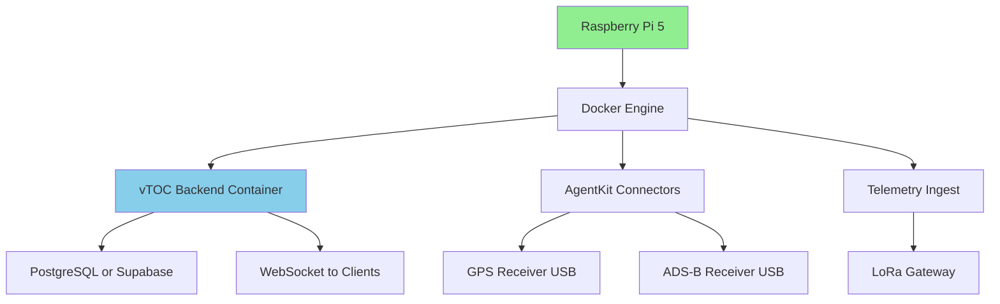
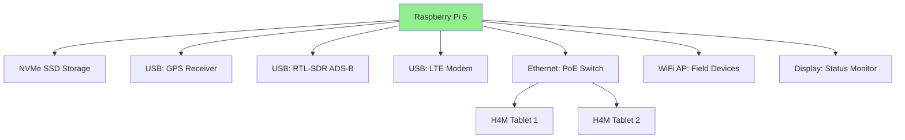
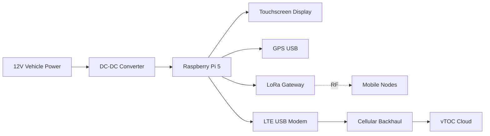

# Raspberry Pi 5 (Field Deployments + TOC-Box Integration)

## Overview

The Raspberry Pi 5 represents the latest generation of single-board computers suitable for vTOC deployments. With improved performance, PCIe expansion, and enhanced I/O, it serves as an ideal compute node for field stations, TOC boxes, and edge processing applications.

**Note:** For detailed Raspberry Pi 5 deployment procedures, see the comprehensive [Raspberry Pi 5 Deployment Guide](../deployment/raspberry-pi.md).

## Capabilities

- **Compute Power:** Quad-core ARM Cortex-A76 @ 2.4 GHz
- **Memory:** 4 GB or 8 GB LPDDR4X-4267 RAM
- **Storage:** MicroSD or NVMe SSD via M.2 HAT
- **Networking:** Gigabit Ethernet + dual-band WiFi 6 (optional)
- **USB:** 2× USB 3.0, 2× USB 2.0
- **Video:** Dual 4K60 HDMI output
- **GPIO:** 40-pin header (backward compatible)
- **PCIe:** 1× PCIe 2.0 lane (via M.2 HAT)
- **Real-Time Clock:** Built-in RTC with battery backup
- **Power:** USB-C PD (5V/5A nominal, 27W peak)

## Power Requirements

- **Input Voltage:** 5V via USB-C Power Delivery
- **Current Draw:**
  - Idle (no peripherals): 1.6-2.4A (8-12W)
  - Typical load: 2.5-3.5A (12-17W)
  - Peak (USB devices + NVMe): 5A (25W)
  - With peripherals (USB SDR, GPS, etc.): 6-8A total
- **Official PSU:** 27W USB-C PD adapter (required for reliability)
- **Power Budget:**
  - Pi 5 baseline: 12W
  - NVMe SSD: +3-5W
  - USB peripherals: +5-10W (SDR, GPS, etc.)
  - HATs: +2-5W each
  - **Total:** 25-35W typical for full vTOC station

## Hardware Specifications

| Parameter | Specification |
|-----------|--------------|
| **CPU** | Broadcom BCM2712 (ARM Cortex-A76 quad-core @ 2.4 GHz) |
| **GPU** | VideoCore VII |
| **RAM** | 4 GB or 8 GB LPDDR4X-4267 |
| **Storage** | MicroSD slot (UHS-I), PCIe M.2 NVMe via HAT |
| **Network** | Gigabit Ethernet (RP1 I/O controller) |
| **WiFi/BT** | Optional: Dual-band WiFi 6, BT 5.2 (BCM43456) |
| **USB** | 2× USB 3.0 (5 Gbps), 2× USB 2.0 |
| **Video Out** | 2× micro-HDMI (4K60 or 1080p120) |
| **GPIO** | 40-pin HAT-compatible header |
| **PCIe** | 1× PCIe 2.0 x1 lane (M.2 M-key via HAT) |
| **RTC** | Built-in with coin cell backup |
| **Dimensions** | 85mm × 56mm |
| **Weight** | ~45g |
| **Operating Temp** | 0°C to +50°C (with active cooling) |

## Deployment Notes

### Use Cases in vTOC

#### 1. TOC-Box Compute Node

The Pi 5 serves as the central compute node in a ruggedized TOC box:

- **Role:** Run vTOC backend, database (if local), telemetry connectors
- **Connectivity:** Ethernet uplink, WiFi for H4M tablets
- **Storage:** NVMe SSD for fast database access
- **Peripherals:** GPS receiver, ADS-B receiver (RTL-SDR)
- **Display:** Optional HDMI to monitor for status display

#### 2. Field Station

Deployed as a standalone field node:

- **Role:** Remote data collection and relay
- **Power:** Solar panel + battery bank (40-60Ah for 24/7)
- **Connectivity:** LTE modem for backhaul, LoRa for local mesh
- **Environmental:** IP67 enclosure with temperature regulation
- **Storage:** Local buffering of telemetry (NVMe)

#### 3. Vehicle-Mounted Station

Mobile station in command vehicle:

- **Role:** Mobile TOC with map interface
- **Power:** 12V DC vehicle power (DC-DC converter to 5V/5A)
- **Display:** 7-10" touchscreen for mission console
- **Connectivity:** Cellular + StarLink for SATCOM
- **Mounting:** Shock-mounted case for vibration isolation

### Installation and Setup

See [Raspberry Pi 5 Deployment Guide](../deployment/raspberry-pi.md) for comprehensive setup instructions, including:

- Operating system preparation (Raspberry Pi OS Lite 64-bit)
- OS tuning (GPU memory, cgroups, ZRAM swap)
- Service enablement matrix
- Bootstrap workflow for vTOC software
- Resource-conscious Docker profiles

### Recommended Accessories

#### Essential

- **Power Supply:** Official 27W USB-C PSU (mandatory)
- **Cooling:** Active cooler or case with fan (thermal management)
- **Storage:** 128 GB+ NVMe SSD with M.2 HAT (preferred over microSD)
- **Case:** Aluminum or ventilated plastic case

#### Field Deployments

- **PoE HAT:** Power over Ethernet HAT for simplified wiring
- **UPS HAT:** Battery backup HAT (18650 cells, 5-30 min runtime)
- **GPS HAT:** Precision time source (PPS for NTP)
- **LTE HAT:** Cellular modem (Sixfab, Waveshare)
- **Enclosure:** IP67-rated enclosure for outdoor use

#### TOC-Box Integration

- **Touchscreen:** Official 7" display or HDMI monitor
- **Network Switch:** Gigabit PoE switch for peripherals
- **USB Hub:** Powered USB 3.0 hub for multiple SDRs
- **Battery:** Portable power station (200-500Wh)

### Cooling Considerations

The Pi 5 generates more heat than previous generations:

- **Passive Cooling:** Heatsink case (suitable for light loads only)
- **Active Cooling:** 30mm fan (engages at 60°C recommended)
- **PoE HAT:** Includes fan (adjustable curve via `raspi-config`)
- **Thermal Throttle:** CPU throttles at 85°C (avoid for sustained workloads)

**Temperature Monitoring:**
```bash
# Check CPU temperature
vcgencmd measure_temp

# Monitor continuously
watch -n 2 vcgencmd measure_temp
```

### Performance Improvements vs. Pi 4

| Metric | Raspberry Pi 4 | Raspberry Pi 5 | Improvement |
|--------|----------------|----------------|-------------|
| **CPU** | Cortex-A72 @ 1.8 GHz | Cortex-A76 @ 2.4 GHz | 2-3x |
| **RAM** | LPDDR4-3200 | LPDDR4X-4267 | 33% bandwidth |
| **USB** | 2× USB 3.0 (shared) | 2× USB 3.0 (dedicated) | No bottleneck |
| **Ethernet** | 1 Gbps (USB) | 1 Gbps (native) | Lower latency |
| **PCIe** | None | 1× PCIe 2.0 | NVMe support |
| **RTC** | None | Built-in | Time keeping |

**vTOC Impact:** Faster Docker container startup, better concurrent telemetry processing, NVMe enables larger local databases.

## Integration with vTOC

The Pi 5 runs the core vTOC stack via Docker Compose:

### Service Architecture



### Docker Compose Configuration

Example `docker-compose.yml` for Pi 5 station:

```yaml
version: '3.8'

services:
  vtoc-backend:
    image: ghcr.io/pr-cybr/vtoc-backend:latest
    container_name: vtoc-backend
    restart: unless-stopped
    ports:
      - "3000:3000"
    environment:
      - DATABASE_URL=${DATABASE_URL}
      - SUPABASE_URL=${SUPABASE_URL}
      - SUPABASE_KEY=${SUPABASE_KEY}
    volumes:
      - ./data:/app/data
    mem_limit: 1g
    cpus: 2
    
  agentkit-gps:
    image: ghcr.io/pr-cybr/agentkit-gps:latest
    container_name: agentkit-gps
    restart: unless-stopped
    devices:
      - /dev/ttyUSB0:/dev/ttyUSB0
    environment:
      - GPS_PORT=/dev/ttyUSB0
      - GPS_BAUDRATE=9600
      - VTOC_API=${VTOC_API_URL}
    
  agentkit-adsb:
    image: ghcr.io/pr-cybr/agentkit-adsb:latest
    container_name: agentkit-adsb
    restart: unless-stopped
    devices:
      - /dev/bus/usb:/dev/bus/usb
    environment:
      - RTLSDR_DEVICE=0
      - VTOC_API=${VTOC_API_URL}
```

### Resource Limits

For Pi 5 (8 GB RAM model), recommended allocation:

- **vTOC Backend:** 1-2 GB RAM, 2 CPU cores
- **Telemetry Connectors:** 256-512 MB each, 0.5 CPU cores each
- **System Overhead:** 1-2 GB RAM for OS, Docker daemon
- **Headroom:** Leave 2 GB free for buffers/cache

## Integration Diagrams

### TOC-Box Configuration



### Vehicle-Mounted Station



## Troubleshooting

### Under-voltage Warnings

Symptom: Rainbow square icon, throttling, random crashes

```bash
# Check for under-voltage events
vcgencmd get_throttled
# 0x0 = no issues
# 0x50000 = under-voltage occurred
```

**Solution:**
- Use official 27W PSU (mandatory)
- Avoid cheap USB-C cables (must support 5A)
- Reduce peripheral power draw (powered USB hub)

### Thermal Throttling

Symptom: CPU frequency drops, sluggish performance

```bash
# Check current frequency
vcgencmd measure_clock arm

# Monitor throttling
vcgencmd get_throttled
# 0x2 = currently throttled
```

**Solution:**
- Add active cooling (30mm fan)
- Improve case ventilation
- Reduce ambient temperature
- Lower CPU governor: `sudo cpufreq-set -g powersave`

### NVMe Not Detected

Symptom: NVMe SSD not visible after HAT installation

```bash
# Check PCIe devices
lspci
# Should show: Non-Volatile memory controller

# Check block devices
lsblk
# Should show: nvme0n1
```

**Solution:**
- Update bootloader: `sudo rpi-eeprom-update -a`
- Enable PCIe in config: Add `dtparam=pciex1` to `/boot/firmware/config.txt`
- Verify M.2 SSD compatibility (NVMe only, not SATA M.2)

### USB Devices Disconnecting

Symptom: GPS, RTL-SDR drop intermittently

**Solution:**
- Check power supply capacity (5A required)
- Use powered USB hub for multiple devices
- Disable USB autosuspend: Add `usbcore.autosuspend=-1` to `/boot/firmware/cmdline.txt`
- Update firmware/kernel

## Best Practices

1. **Power Management:**
   - Always use official 27W PSU
   - Use UPS/battery backup for critical deployments
   - Monitor voltage with `vcgencmd` (avoid < 4.8V)

2. **Storage:**
   - Prefer NVMe over microSD (10x faster, more reliable)
   - Use high-quality microSD if NVMe not available (A2 rated)
   - Enable ZRAM swap to reduce writes
   - Regular backups (image whole system)

3. **Cooling:**
   - Active cooling mandatory for 24/7 operation
   - Clean fan filters monthly (dust buildup)
   - Thermal paste on CPU (pre-applied or Arctic MX-4)

4. **Security:**
   - Change default password immediately
   - Enable SSH key-only authentication
   - Configure firewall: `sudo ufw enable`
   - Keep system updated: `sudo apt update && sudo apt upgrade`

5. **Monitoring:**
   - Setup monitoring (Prometheus + Grafana)
   - Alert on temperature > 75°C, voltage < 4.9V
   - Log Docker container health
   - Track disk usage (NVMe wear leveling)

## Related Documentation

- [Raspberry Pi 5 Deployment Guide](../deployment/raspberry-pi.md) - Comprehensive setup
- [Hardware Overview](../HARDWARE.md) - Station hardware architecture
- [Deployment Guide](../DEPLOYMENT.md) - Production deployment procedures
- [BYONICS PiCon](BYONICS-PICON.md) - GPIO HAT for APRS

## External Resources

- [Raspberry Pi 5 Documentation](https://www.raspberrypi.com/documentation/computers/raspberry-pi.html)
- [Raspberry Pi Forums](https://forums.raspberrypi.com/)
- [Pi 5 Benchmarks](https://www.phoronix.com/review/raspberry-pi-5)
- [Awesome Raspberry Pi](https://github.com/thibmaek/awesome-raspberry-pi)
