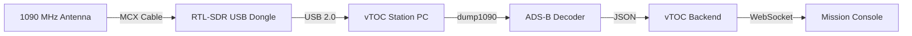
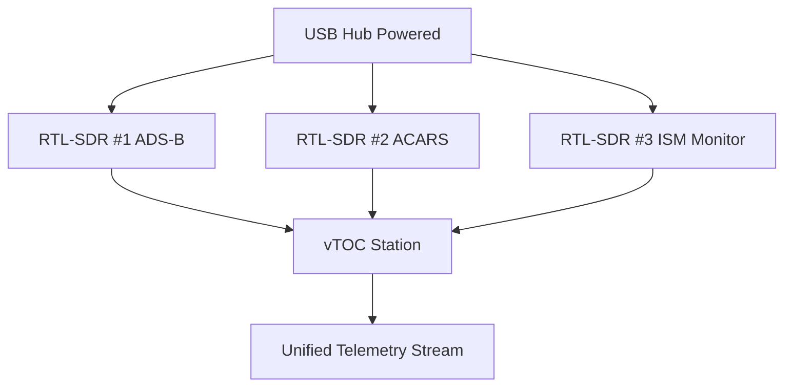

# RTL-SDR (USB SDR Receiver)

## Overview

The RTL-SDR is a low-cost USB software-defined radio (SDR) receiver that enables wideband radio monitoring from 24 MHz to 1766 MHz. It's widely used in vTOC deployments for spectrum analysis, ADS-B reception, and general-purpose RF monitoring.

## Capabilities

- **Frequency Range:** 24 MHz - 1766 MHz (varies by tuner chip)
- **Sample Rate:** Up to 2.4 MSPS (3.2 MSPS unstable)
- **Bandwidth:** ~2 MHz usable bandwidth
- **ADC Resolution:** 8-bit
- **Sensitivity:** Good (-20 to -30 dBm typical)
- **Applications:**
  - ADS-B aircraft tracking (1090 MHz)
  - ACARS monitoring
  - VHF/UHF radio reception
  - NOAA weather satellite imagery
  - LoRa signal analysis
  - Spectrum scanning
  - ISM band monitoring (433/915 MHz)

## Power Requirements

- **Power Source:** USB 2.0/3.0 (5V)
- **Current Draw:** 200-300 mA typical
- **Power Consumption:** ~1-1.5W
- **USB Standard:** Compatible with USB 2.0 or higher

## Hardware Specifications

| Parameter | Specification |
|-----------|--------------|
| Interface | USB 2.0 Type-A |
| Tuner Chip | R820T/R820T2 (most common) |
| ADC | RTL2832U |
| Antenna Connector | MCX or SMA female |
| Dimensions | ~90mm × 25mm × 12mm |
| Weight | ~30-50g |
| Operating Temperature | 0°C to +50°C |

## Deployment Notes

### Installation

1. **Driver Installation:**
   - Linux: Use `rtl-sdr` package from distribution repositories
   ```bash
   sudo apt install rtl-sdr librtlsdr-dev
   ```
   - Test device detection: `rtl_test`
   
2. **Blacklist DVB-T Drivers:**
   ```bash
   echo "blacklist dvb_usb_rtl28xxu" | sudo tee /etc/modprobe.d/blacklist-rtl.conf
   sudo modprobe -r dvb_usb_rtl28xxu
   ```

3. **Set Device Permissions:**
   ```bash
   sudo usermod -a -G plugdev $USER
   # Create udev rule
   echo 'SUBSYSTEM=="usb", ATTRS{idVendor}=="0bda", ATTRS{idProduct}=="2838", MODE="0666"' | \
     sudo tee /etc/udev/rules.d/20-rtlsdr.rules
   sudo udevadm control --reload-rules
   ```

### Calibration

RTL-SDR devices have frequency offset that should be calibrated:

```bash
# Using kalibrate-rtl (GSM calibration)
kal -s GSM900  # Scan for GSM towers
kal -c <channel> # Calibrate using strongest channel
```

Record the PPM offset and configure in your SDR applications.

### Connection to vTOC

The RTL-SDR integrates with vTOC through the telemetry connector framework:

1. **ADS-B Integration:** See [ADS-B Integration Guide](../ADSB.md)
2. **Custom Monitoring:** Use `rtl_tcp` server mode for remote access
3. **AgentKit Connector:** Configure in `.env.station`

```bash
# Example rtl_tcp daemon
rtl_tcp -a 0.0.0.0 -p 1234 -d 0 -P 55
```

## Recommended Antennas

### ADS-B (1090 MHz)

- **Type:** 1/4 wave vertical collinear
- **Gain:** 2-5 dBi
- **Cable:** RG-58 or LMR-200 (keep runs < 10m)
- **Connector:** MCX to N-type or SMA adapter
- **Mounting:** Roof-mounted, clear LOS to sky
- **Products:**
  - FlightAware 1090 MHz filter + antenna
  - Jetvision A3 antenna
  - DIY: 1/4 wave ground plane (68mm elements)

### Wideband Monitoring

- **Type:** Discone antenna (25 MHz - 1.3 GHz)
- **Gain:** 0-3 dBi (omnidirectional)
- **Mounting:** 3-6m height, clear of obstructions
- **Products:**
  - Diamond D130J
  - Tram 1410

### Portable/Temporary

- **Type:** Telescoping whip antenna
- **Frequency:** Tunable via length adjustment
- **Gain:** -5 to 0 dBi
- **Use Case:** Field operations, spectrum surveys

## Integration Diagrams

### Basic ADS-B Setup



### Multi-SDR Station



## Troubleshooting

### Device Not Detected

```bash
# Check USB enumeration
lsusb | grep Realtek
# Expected: Bus XXX Device XXX: ID 0bda:2838 Realtek...

# Check dmesg for errors
dmesg | grep rtl
```

### Poor Reception

1. **Check antenna connection:** Ensure MCX connector is fully seated
2. **Set gain manually:** Auto-gain can be suboptimal
   ```bash
   rtl_test -g 40  # Try gains 0-50
   ```
3. **Reduce USB interference:** Use shielded USB cable, add ferrite cores
4. **Check frequency offset:** Re-calibrate PPM correction

### USB Bandwidth Issues

- Use USB 2.0 port directly on motherboard (not hub)
- Reduce sample rate: 2.048 MSPS is more stable than 2.4 MSPS
- Check for USB 3.0 interference (try disabling xHCI)

## Best Practices

1. **Thermal Management:** RTL-SDR devices heat up during continuous operation
   - Add heatsink to tuner chip for 24/7 operation
   - Ensure adequate airflow in enclosure
   
2. **Bias-T (if available):** Some RTL-SDR V3 models support bias-T for powering LNAs
   ```bash
   rtl_biast -b 1  # Enable bias-T
   ```

3. **Filtering:** Use SAW filters to prevent overload from strong signals
   - 1090 MHz filter for ADS-B
   - FM broadcast filter for general monitoring

4. **Cable Quality:** Use quality coax to minimize signal loss
   - RG-58: Good for runs < 5m
   - LMR-200: Better for runs 5-15m
   - LMR-400: Best for runs > 15m

5. **Backup Device:** Keep spare RTL-SDR in deployment kit (low cost)

## Related Documentation

- [ADS-B Integration](../ADSB.md) - Full ADS-B reception setup
- [Hardware Overview](../HARDWARE.md) - Station hardware architecture
- [Antenna Systems](ANTENNAS.md) - Antenna selection and deployment
- [Deployment Guide](../DEPLOYMENT.md) - Production deployment procedures

## External Resources

- [RTL-SDR Quick Start Guide](https://www.rtl-sdr.com/rtl-sdr-quick-start-guide/)
- [dump1090 ADS-B Decoder](https://github.com/flightaware/dump1090)
- [rtl_433 ISM Band Decoder](https://github.com/merbanan/rtl_433)
- [GQRX SDR Software](https://gqrx.dk/)
