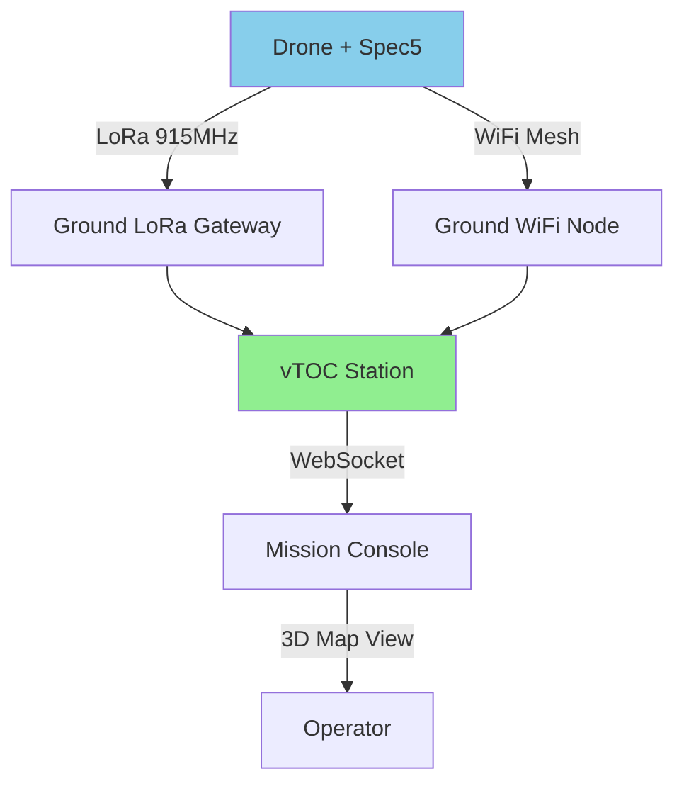
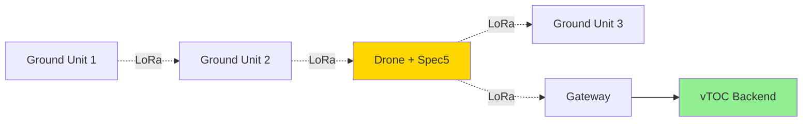
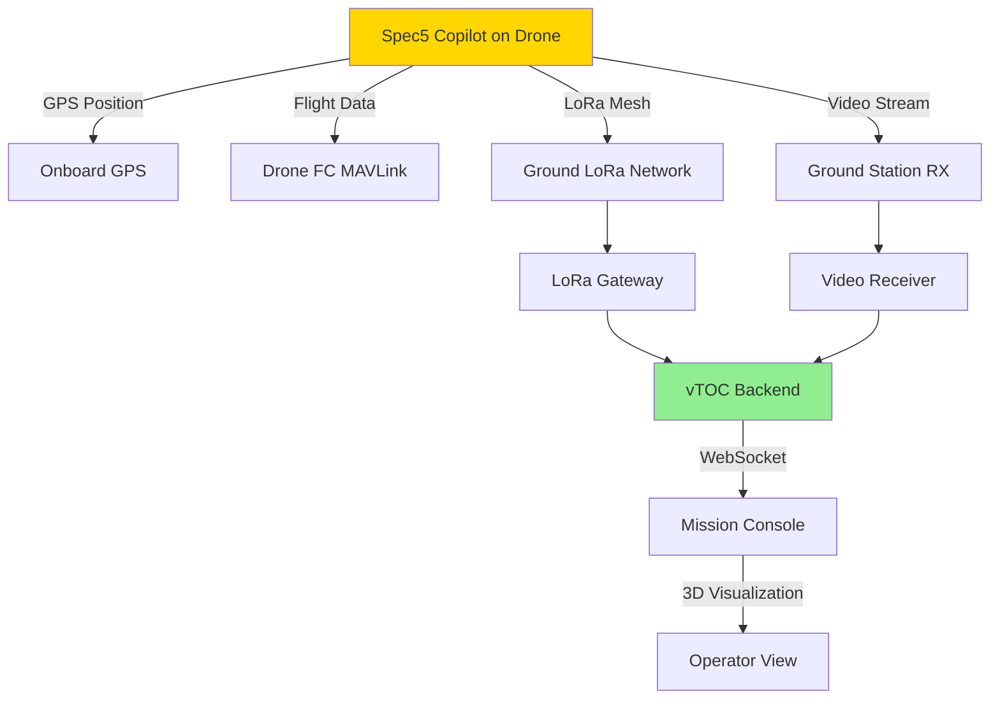
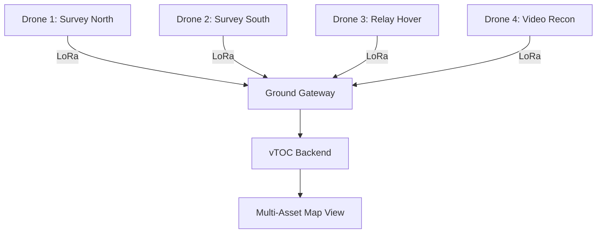

# Spec5 Copilot (Drone-Mounted Node)

## Overview

The Spec5 Copilot is a drone-mountable telemetry and communication node designed for aerial reconnaissance, area mapping, and relay operations. It integrates GPS tracking, mesh networking, video streaming, and sensor data collection in a lightweight, flight-ready package.

## Capabilities

- **Aerial Telemetry:** Real-time drone position, altitude, battery, heading
- **Video Streaming:** 1080p video downlink (optional HD FPV camera)
- **Mesh Networking:** LoRa or WiFi mesh relay for ground units
- **Sensor Platform:** Support for thermal, multispectral, LiDAR sensors
- **Autonomous Waypoints:** Pre-programmed survey missions
- **LOS Extension:** Aerial relay extends ground mesh range 10-50x
- **Flight Time:** 20-45 minutes (depends on drone platform)
- **Range:** 2-5 km telemetry (line-of-sight)

## Power Requirements

- **Input Voltage:** 7.4-14.8V (2S-4S LiPo)
- **Current Draw:**
  - Idle: 50-100 mA
  - GPS + mesh active: 150-300 mA
  - Video streaming: 400-800 mA
  - Peak (all systems): 1.2-1.5A
- **Power Consumption:** 5-15W average
- **Power Input:** JST-XH or XT60 from drone battery
- **Voltage Regulator:** Onboard 5V/3.3V switching regulators
- **Flight Time Impact:** ~10-15% reduction vs. clean airframe

## Hardware Specifications

| Parameter | Specification |
|-----------|--------------|
| Processor | ARM Cortex-M4 or Raspberry Pi Zero 2 |
| GPS | U-blox M8/M9 with compass |
| LoRa Radio | SX1276/SX1278 (915 MHz) |
| WiFi | ESP32 or similar (2.4/5 GHz) |
| Video | MIPI CSI interface or analog VTX |
| Sensors | I2C/SPI for external sensors |
| Storage | MicroSD card (flight logs, video) |
| Dimensions | 60mm × 40mm × 20mm |
| Weight | 45-85g (variant dependent) |
| Mounting | M3 vibration-damped standoffs |
| Operating Temperature | 0°C to +50°C |
| Altitude | Tested to 3000m AGL |

## Deployment Notes

### Drone Platform Selection

Compatible with:
- **DJI Matrice Series:** M210, M300, M30 (requires SDK integration)
- **Ardupilot/PX4 Drones:** Direct UART/MAVLink integration
- **Fixed-Wing:** Long-range survey platforms (60+ min endurance)
- **Custom Builds:** Integration via MAVLink, PWM, or serial

**Weight Budget:**
- Add 100-150g total (node + mounting + cables)
- Ensure drone payload capacity accommodates extra weight
- Re-tune flight controller after installation (PID loops)

### Installation

1. **Mounting Location:**
   - Top plate (clear GPS/LoRa antenna view)
   - Avoid propeller downwash zones
   - Minimize interference from ESCs/motors
   - Use vibration-damping standoffs

2. **Power Connection:**
   ```
   Drone Battery (2-4S LiPo)
       ↓
   XT60/JST connector
       ↓
   Spec5 Copilot (7.4-14.8V input)
       ↓
   Onboard regulator (5V/3.3V)
   ```

3. **Telemetry Integration:**
   - **MAVLink:** UART connection to flight controller
   - **MSP:** For Betaflight/iNav drones
   - **Custom:** Serial JSON output to ground station

4. **Antenna Placement:**
   - GPS: Top-mounted with ground plane
   - LoRa: Vertical whip or stubby (915 MHz)
   - Video: Cloverleaf or pagoda (5.8 GHz FPV)
   - Keep antennas separated (>5cm) to avoid interference

### Firmware Configuration

```bash
# Connect via USB-C (FTDI serial bridge)
screen /dev/ttyUSB0 115200

# Configure via AT commands or config file
AT+FREQ=915000000        # LoRa frequency (Hz)
AT+SF=7                  # Spreading factor (7-12)
AT+BW=250                # Bandwidth (kHz)
AT+POWER=20              # TX power (dBm)
AT+GPS=1                 # Enable GPS
AT+TELEMETRY=MAVLINK     # Protocol selection
AT+VIDEO=1080P30         # Video resolution/framerate
AT+SAVE                  # Write to flash
```

### Integration with vTOC

#### Real-Time Telemetry

The Spec5 Copilot streams drone telemetry to vTOC backend:



#### MAVLink Parsing

```python
# Example: Parse MAVLink from Spec5 Copilot
from pymavlink import mavutil

# Connect to Spec5 serial or UDP stream
master = mavutil.mavlink_connection('/dev/ttyUSB0', baud=57600)

while True:
    msg = master.recv_match(blocking=True)
    if msg.get_type() == 'GLOBAL_POSITION_INT':
        # Extract position data
        lat = msg.lat / 1e7
        lon = msg.lon / 1e7
        alt = msg.relative_alt / 1000.0  # mm to meters
        
        # Push to vTOC database
        update_drone_position('DRONE-001', lat, lon, alt)
```

#### Mesh Relay Operation

The Spec5 can relay ground mesh traffic while airborne:



**Range Improvement:**
- Ground-to-ground: 2-5 km typical
- Ground-to-air-to-ground: 10-25 km (drone at 100m AGL)
- Air-to-gateway: 30-50 km (optimal conditions)

### Deployment Scenarios

#### Scenario 1: Area Survey with Ground Coordination

- Drone flies pre-programmed waypoints
- Spec5 relays ground team positions to TOC
- Video streams area reconnaissance
- Thermal sensor identifies heat signatures
- All telemetry visualized in vTOC map

#### Scenario 2: Temporary Mesh Relay

- Deploy drone to hover at optimal relay altitude (50-150m)
- Extends mesh range for difficult terrain (mountains, urban)
- Provides connectivity for hours (hover endurance)
- Automated return-to-home on low battery

#### Scenario 3: Search and Rescue

- Drone searches area with thermal/optical camera
- Ground teams receive real-time video via mesh
- Spec5 broadcasts ground team positions to SAR coordinator
- vTOC tracks all assets and targets simultaneously

## Recommended Antennas

### LoRa (915 MHz)

- **Type:** 1/4 wave whip or helical
- **Gain:** 0-3 dBi (omnidirectional for aerial)
- **Polarization:** Vertical (match ground stations)
- **Mounting:** Carbon fiber mast (5-10 cm above drone body)
- **Products:**
  - 915 MHz 2dBi stubby antenna
  - 868/915 MHz flexible whip

### GPS

- **Type:** Active patch antenna with ground plane
- **Gain:** 28 dBi typical
- **Mounting:** Flat on top plate, sky-facing
- **Cable:** Keep < 15cm to minimize loss
- **Products:**
  - U-blox ANN-MB series
  - Taoglas embedded GPS patch

### Video (if FPV equipped)

- **Type:** Circular polarized (RHCP)
- **Gain:** 1-3 dBi
- **Frequency:** 5.8 GHz
- **Mounting:** Tail or underside (avoid prop interference)
- **Products:**
  - TrueRC Singularity
  - Lumenier AXII

## Integration Diagrams

### Full System Architecture



### Multi-Drone Deployment



## Troubleshooting

### GPS Not Locking

1. **Compass calibration:** Perform figure-8 calibration before flight
2. **EMI from ESCs:** Move GPS away from power cables/ESCs (>10cm)
3. **Carbon fiber shield:** Carbon blocks GPS, use spacer/riser
4. **Ground plane:** Add copper tape ground plane under GPS antenna

### LoRa Link Dropouts

1. **Antenna polarization:** Ensure vertical match with ground stations
2. **Vibration damage:** Check antenna connector not loose
3. **Range:** Adjust spreading factor (SF12 for max range)
4. **Interference:** ESCs, video TX can interfere, add shielding

### Excessive Weight/Drag

1. **Minimize cables:** Use shortest possible runs
2. **Streamline antennas:** Use low-profile antennas
3. **3D print fairing:** Reduce drag with aerodynamic cover
4. **Lighter variant:** Remove unused features (video if not needed)

### Video Latency

1. **Compression:** Lower resolution (720p) reduces latency
2. **WiFi mesh:** WiFi has more latency than analog VTX
3. **Bandwidth:** Ensure sufficient LoRa/WiFi bandwidth
4. **Distance:** Latency increases with range/hop count

## Best Practices

1. **Pre-Flight Checks:**
   - GPS lock obtained (4+ satellites)
   - LoRa link established with ground station
   - Battery voltage > 75% (drone + Spec5)
   - Antennas secure (vibration check)
   - Compass calibrated (away from metal)

2. **Flight Planning:**
   - Plan for 10-15% reduced flight time
   - Set return-to-home at 30% battery (safety margin)
   - Establish comms check points during mission
   - Designate emergency landing zones

3. **Mesh Relay Altitude:**
   - 50-100m AGL: Good for ground mesh relay
   - 100-200m AGL: Extended range, watch airspace restrictions
   - Hover mode: Use for static relay operations
   - Auto-loiter: Configure failsafe to hover, not land

4. **Data Management:**
   - Log all telemetry to microSD (backup)
   - Stream critical data (position) over mesh
   - Buffer video locally if bandwidth insufficient
   - Download logs after flight for analysis

5. **Safety:**
   - Comply with FAA Part 107 or local regulations
   - Maintain VLOS (visual line of sight) unless waiver
   - No-fly zones: Check airspace before deployment
   - Insurance: Verify commercial coverage if applicable

6. **Maintenance:**
   - Clean antennas after dusty/muddy ops
   - Check vibration dampers monthly
   - Inspect cables for prop strike damage
   - Update firmware before critical missions

## Related Documentation

- [LoRa MANET Node](LORA-MANET.md) - Ground mesh networking
- [Geospatial Mesh Planning](../MESH_PLANNING/OVERVIEW.md) - Network coverage planning
- [Antenna Systems](ANTENNAS.md) - Antenna selection and tuning
- [Hardware Overview](../HARDWARE.md) - Station hardware architecture

## External Resources

- [ArduPilot MAVLink Documentation](https://ardupilot.org/dev/docs/mavlink-basics.html)
- [LoRa Range Calculator](https://www.loratools.nl/#/airtime)
- [FAA Part 107 Guide](https://www.faa.gov/uas/commercial_operators)
- [Drone Deploy Mission Planning](https://www.dronedeploy.com/)
