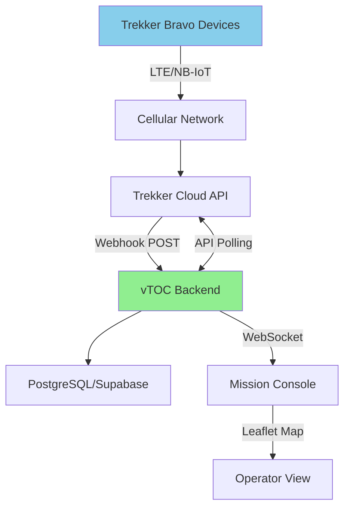
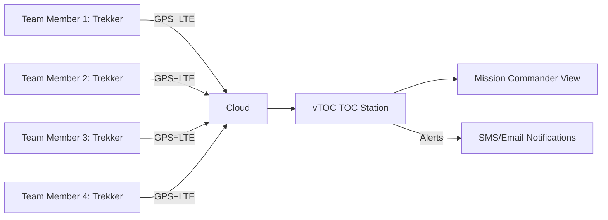

# Trekker Bravo GPS Tracker

## Overview

The Trekker Bravo is a ruggedized, battery-powered GPS tracker designed for asset tracking, personnel monitoring, and vehicle telemetry in field operations. It provides real-time position reporting with cellular (LTE/3G) and satellite communication fallback options.

## Capabilities

- **GPS Tracking:** High-sensitivity GPS/GLONASS receiver
- **Connectivity:** 
  - LTE Cat-M1/NB-IoT cellular
  - Optional: Iridium satellite fallback
- **Geofencing:** Up to 50 programmable zones with alerts
- **Motion Detection:** 3-axis accelerometer for movement sensing
- **SOS Button:** Emergency alert with position broadcast
- **Data Storage:** 10,000+ position records (offline mode)
- **Update Intervals:** 10 seconds to 24 hours (configurable)
- **Battery Life:** 30-90 days (interval dependent)
- **IP Rating:** IP67 (waterproof, dustproof)

## Power Requirements

- **Battery Type:** Rechargeable Li-ion (internal)
- **Capacity:** 5000 mAh
- **Charging:** USB-C (5V/2A)
- **Charge Time:** 3-4 hours (full charge)
- **Current Draw:**
  - Sleep mode: 0.5-1 mA
  - GPS active: 25-50 mA
  - Cellular transmit: 100-200 mA (burst)
  - Average: 5-15 mA (1-hour reporting)
- **Battery Life Examples:**
  - 1-minute updates: 7-10 days
  - 5-minute updates: 20-30 days
  - 1-hour updates: 60-90 days
  - Motion-activated: 30-60 days

## Hardware Specifications

| Parameter | Specification |
|-----------|--------------|
| Dimensions | 95mm × 65mm × 28mm |
| Weight | ~180g (with battery) |
| GPS Chipset | U-blox M8 or newer |
| Cellular | LTE Cat-M1, NB-IoT, 2G fallback |
| Accelerometer | 3-axis, 2g/4g/8g range |
| Operating Temperature | -20°C to +60°C |
| Storage Temperature | -30°C to +70°C |
| Enclosure Rating | IP67 (1m submersion, 30 min) |
| Mounting | Belt clip, velcro, magnetic case |
| SIM Card | Nano-SIM (external or eSIM) |
| Antenna | Internal quad-band GSM + GPS patch |

## Deployment Notes

### Initial Setup

1. **SIM Card Installation:**
   - Remove rear cover (4 screws)
   - Insert nano-SIM card (carrier compatible with LTE Cat-M1)
   - Recommended carriers: AT&T, Verizon (US); Vodafone, T-Mobile (EU)
   - eSIM activation via manufacturer portal (if equipped)

2. **Device Activation:**
   - Charge fully before first use (LED indicator: red → green)
   - Download Trekker mobile app (iOS/Android)
   - Scan QR code on device or enter IMEI manually
   - Configure tracking parameters in app

3. **Tracking Configuration:**
   ```
   Update Interval: 1-5 minutes (field ops)
   Motion Threshold: Medium (reduces false triggers)
   Geofence: Define operational area
   SOS Recipients: Add emergency contacts
   Low Battery Alert: Enable (10% threshold)
   ```

4. **Testing:**
   - Take device outdoors for GPS lock (1-5 minutes)
   - Verify position appears in web portal/app
   - Test SOS button (sends test alert)
   - Confirm cellular connectivity (check signal bars on app)

### Integration with vTOC

The Trekker Bravo can feed tracking data to vTOC through its API:

#### Method 1: Webhook Integration

Configure Trekker cloud platform to POST position updates to vTOC:

```bash
# Configure webhook in Trekker portal
Webhook URL: https://vtoc.example.com/api/telemetry/trekker
Method: POST
Auth: Bearer <vtoc-api-token>
Event Types: position_update, sos_alert, geofence_breach
```

Example webhook payload:
```json
{
  "device_id": "TREKKER-001",
  "timestamp": "2024-11-16T20:00:00Z",
  "latitude": 42.3601,
  "longitude": -71.0589,
  "altitude": 15,
  "speed": 5.2,
  "heading": 90,
  "battery": 78,
  "event_type": "position_update"
}
```

#### Method 2: API Polling

vTOC backend polls Trekker API for device positions:

```python
import requests

# Example: Fetch positions from Trekker API
headers = {
    'Authorization': f'Bearer {TREKKER_API_KEY}',
    'Content-Type': 'application/json'
}

response = requests.get(
    'https://api.trekker.com/v1/devices/positions',
    headers=headers,
    params={'devices': 'TREKKER-001,TREKKER-002,TREKKER-003'}
)

positions = response.json()
# Push to vTOC database
```

#### Method 3: MQTT Bridge (if supported)

Some enterprise Trekker accounts support MQTT publishing:

```python
import paho.mqtt.client as mqtt

def on_message(client, userdata, msg):
    # Parse Trekker position message
    import json
    data = json.loads(msg.payload)
    # Forward to vTOC backend
    forward_to_vtoc(data)

client = mqtt.Client()
client.on_message = on_message
client.connect("mqtt.trekker.com", 1883)
client.subscribe("trekker/positions/+")
client.loop_forever()
```

### Deployment Scenarios

#### Scenario 1: Personnel Tracking

- **Use Case:** Field team position monitoring
- **Interval:** 2-5 minutes
- **Mounting:** Belt clip or chest harness
- **Geofencing:** Operational area boundaries
- **SOS Integration:** Emergency response coordination

#### Scenario 2: Vehicle Asset Tracking

- **Use Case:** Fleet management
- **Interval:** Motion-activated (1 min moving, 1 hour stationary)
- **Mounting:** Hidden in vehicle (under seat, dashboard)
- **Alerts:** Unauthorized movement, geofence exit
- **Power:** Hardwire to vehicle 12V (with adapter)

#### Scenario 3: Equipment/Cargo Tracking

- **Use Case:** High-value asset monitoring
- **Interval:** 15-60 minutes
- **Mounting:** Secure attachment to container/case
- **Alerts:** Movement detection, temperature (if sensor equipped)
- **Offline Mode:** Store positions if cellular unavailable

## Recommended Accessories

### Mounting Options

- **Belt Clip:** Included, spring-loaded
- **Magnetic Case:** Attaches to vehicle underbody (IP68)
- **Hardwire Kit:** 12V vehicle integration (always-on power)
- **Chest Harness:** Tactical mounting for personnel
- **Padlock Case:** Secure mounting for high-risk environments

### External Antennas (Optional)

For difficult RF environments (metal containers, underground):

- **GPS Antenna:** Active GPS antenna with SMA connector
- **Cellular Antenna:** External LTE antenna (5-10 dBi gain)
- **Cable:** RG-174 or LMR-100 (keep runs < 3m)

## Integration Diagrams

### vTOC Tracking Architecture



### Personnel Tracking System



## Troubleshooting

### Device Won't Power On

1. **Charge battery:** Hold power button 10 seconds, charge 1+ hour
2. **Check LED:** No LED = battery fully depleted, charge overnight
3. **Hard reset:** Remove SIM, hold power 30 seconds, reinstall SIM

### No GPS Fix

1. **Wait for cold start:** 5-15 minutes outdoors with clear sky
2. **Check obstructions:** Avoid indoor use, building shadows
3. **Verify GPS enable:** Check in app settings (GPS may be disabled)
4. **A-GPS data:** Ensure cellular connected (assists GPS lock)

### No Cellular Connection

1. **Check SIM activation:** Verify SIM has active data plan
2. **Verify APN:** Some carriers require manual APN configuration
3. **Signal strength:** Move to area with better coverage
4. **Reboot device:** Power cycle to re-register on network
5. **Check data limit:** Many IoT SIMs have monthly data caps

### Short Battery Life

1. **Reduce update frequency:** Change from 1-min to 5-min intervals
2. **Disable unnecessary features:** Motion alerts if not needed
3. **Check for motion loops:** Device moving continuously (vehicle vibration)
4. **Verify sleep mode:** Device should sleep between updates
5. **Battery age:** Li-ion degrades after 500-1000 cycles (2-3 years)

### Inaccurate Position

1. **Wait for GPS lock:** Check # of satellites (need 4+ for 3D fix)
2. **Urban canyon effect:** Tall buildings cause multipath errors
3. **Indoor/enclosed:** GPS requires sky view, won't work indoors
4. **Check HDOP:** Horizontal dilution of precision > 5 = poor accuracy

## Best Practices

1. **Battery Management:**
   - Charge to 100% before deployment
   - Avoid full discharge (disconnect at 5%)
   - Store at 50% charge if unused > 1 month
   - Replace battery every 2-3 years

2. **Update Intervals:**
   - Match interval to mission needs (don't over-report)
   - Use motion-activated mode for vehicles
   - Increase interval when stationary (battery saving)
   - Consider cellular data costs

3. **Geofencing:**
   - Define realistic operational areas
   - Add buffer zones (50-100m) for GPS accuracy
   - Test geofence alerts before mission
   - Document geofence boundaries in runbook

4. **SOS Configuration:**
   - Assign multiple recipients (redundancy)
   - Test SOS button monthly
   - Brief personnel on proper use (not a toy)
   - Integrate with incident response plan

5. **Weatherproofing:**
   - IP67 rated, but seal USB port when not charging
   - Wipe dry after submersion/heavy rain
   - Avoid charging in wet conditions
   - Store in dry location when not deployed

6. **Security:**
   - Enable 2FA on Trekker account
   - Use strong API credentials
   - Rotate API keys quarterly
   - Limit API access to vTOC backend only
   - Review access logs monthly

## Related Documentation

- [GPS Integration](../GPS.md) - GPS configuration and troubleshooting
- [Hardware Overview](../HARDWARE.md) - Station hardware architecture
- [Trekker Mini](TREKKER-MINI.md) - Smaller form factor variant
- [Deployment Guide](../DEPLOYMENT.md) - Production deployment procedures

## External Resources

- [Trekker Product Specifications](https://www.trekkertracking.com/bravo) (Note: Placeholder URL)
- [LTE Cat-M1 Coverage Maps](https://www.att.com/maps/wireless-coverage.html)
- [GPS Troubleshooting Guide](https://www.u-blox.com/en/docs/UBX-13001426)
