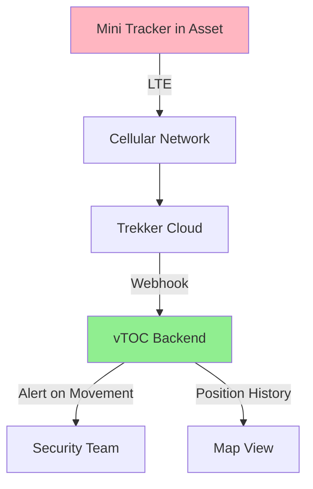
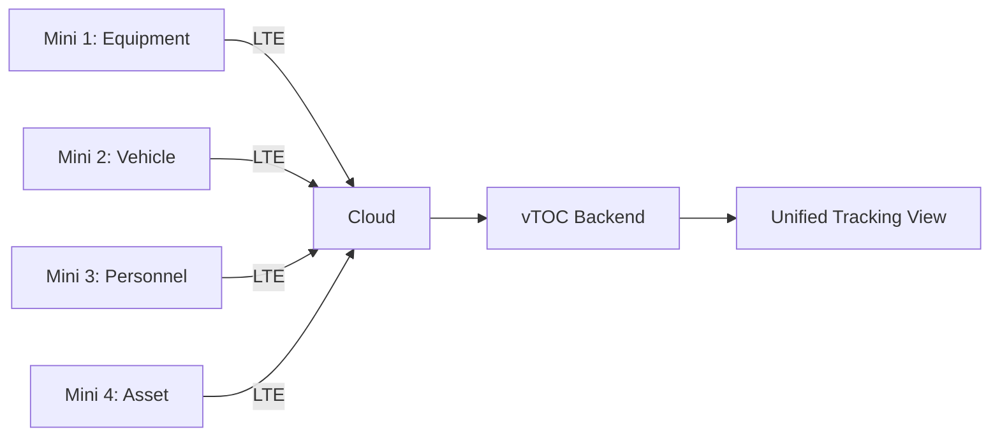

# Trekker Mini GPS Tracker

## Overview

The Trekker Mini is a compact, lightweight GPS tracker designed for covert asset tracking and low-profile personnel monitoring. It offers extended battery life in a smaller form factor compared to the Trekker Bravo, making it ideal for discrete deployments.

## Capabilities

- **GPS Tracking:** High-sensitivity GPS receiver
- **Connectivity:** LTE Cat-M1/NB-IoT
- **Ultra-Compact:** 50% smaller than Trekker Bravo
- **Geofencing:** Up to 20 programmable zones
- **Motion Detection:** Built-in accelerometer
- **Battery Life:** 15-45 days (interval dependent)
- **Update Intervals:** 30 seconds to 24 hours
- **IP Rating:** IP65 (splash-proof, dust-resistant)

## Power Requirements

- **Battery Type:** Rechargeable Li-polymer (internal)
- **Capacity:** 2500 mAh
- **Charging:** Micro-USB (5V/1A)
- **Charge Time:** 2-3 hours (full charge)
- **Current Draw:**
  - Sleep mode: 0.3-0.8 mA
  - GPS active: 20-40 mA
  - Cellular transmit: 80-150 mA (burst)
  - Average: 3-10 mA (5-minute reporting)
- **Battery Life Examples:**
  - 1-minute updates: 4-7 days
  - 5-minute updates: 10-20 days
  - 1-hour updates: 30-45 days
  - Motion-activated: 20-40 days

## Hardware Specifications

| Parameter | Specification |
|-----------|--------------|
| Dimensions | 60mm × 40mm × 15mm |
| Weight | ~65g (with battery) |
| GPS Chipset | U-blox M8 compact |
| Cellular | LTE Cat-M1, NB-IoT |
| Accelerometer | 3-axis, configurable sensitivity |
| Operating Temperature | -10°C to +50°C |
| Storage Temperature | -20°C to +60°C |
| Enclosure Rating | IP65 (splash-proof, not submersible) |
| Mounting | Adhesive backing, velcro, magnetic dock |
| SIM Card | Nano-SIM or eSIM |
| Antenna | Internal compact multi-band |

## Deployment Notes

### Initial Setup

1. **SIM Card Installation (if not eSIM):**
   - Slide open side panel
   - Insert nano-SIM (LTE Cat-M1 compatible)
   - Close panel until click
   - Recommended: Same carriers as Trekker Bravo

2. **Device Activation:**
   - Charge fully (LED: red → green, ~2-3 hours)
   - Download Trekker mobile app
   - Power on (hold button 3 seconds)
   - Scan QR code or enter IMEI
   - Configure via app

3. **Compact Tracking Configuration:**
   ```
   Update Interval: 5-15 minutes (balance battery/resolution)
   Motion Threshold: High (reduce false alerts due to size)
   Geofence: Critical zones only (limited to 20)
   Low Battery Alert: Enable (15% threshold)
   Stealth Mode: No LED/audio (optional for covert ops)
   ```

### Integration with vTOC

The Trekker Mini uses the same API as Trekker Bravo. Refer to [Trekker Bravo Integration](TREKKER-BRAVO.md#integration-with-vtoc) for detailed setup.

#### Quick Integration Example

```python
# Same webhook/API as Trekker Bravo
# Mini devices appear with different device ID prefix
device_id_pattern = "TREKKER-MINI-*"

# Example: Filter Mini devices in vTOC
mini_devices = [d for d in all_devices if 'MINI' in d['device_id']]
```

### Deployment Scenarios

#### Scenario 1: Covert Asset Tracking

- **Use Case:** High-value equipment, discrete monitoring
- **Interval:** 10-30 minutes (balance detection risk)
- **Mounting:** Hidden inside asset (adhesive backing)
- **Alerts:** Motion detection, geofence breach
- **Consideration:** Smaller size = easier concealment

#### Scenario 2: Personnel Discrete Tracking

- **Use Case:** Undercover operations, VIP protection
- **Interval:** 5-10 minutes
- **Mounting:** Pocket, bag lining, clothing sewn-in
- **Power:** Must be charged daily/every-other-day
- **Stealth:** Disable LEDs and sounds

#### Scenario 3: Small Equipment Tracking

- **Use Case:** Tools, cameras, drones, laptops
- **Interval:** 15-30 minutes (extend battery)
- **Mounting:** Adhesive to flat surface inside
- **Alerts:** Movement outside operational hours
- **Offline:** Stores up to 5,000 positions

## Recommended Accessories

### Mounting Options

- **Adhesive Mount:** Industrial 3M VHB tape (included)
- **Magnetic Dock:** Attaches to ferrous surfaces (optional)
- **Velcro Strips:** Hook-and-loop for fabric/gear (included)
- **Waterproof Pouch:** IP67 upgrade for wet environments
- **False Bottom Case:** Concealment in larger containers

### Charging Solutions

- **Micro-USB Cable:** Standard 1A charger (included)
- **Multi-Device Dock:** Charge 6-10 units simultaneously
- **Portable Power Bank:** 5000mAh = 2 full charges
- **Vehicle USB Port:** Charge in field vehicles

## Integration Diagrams

### Discrete Asset Tracking



### Multi-Device Deployment



## Troubleshooting

### Reduced Battery Life

1. **Check update interval:** Lower from 1-min to 5-min saves 70% battery
2. **Motion sensitivity:** Too sensitive = constant GPS polling
3. **Cellular signal:** Poor signal = more power for transmit
4. **Temperature:** Cold reduces battery capacity significantly
5. **Battery age:** LiPo degrades faster than Li-ion (1-2 year life)

### Device Not Connecting

1. **SIM activation:** Verify nano-SIM has active IoT data plan
2. **Network compatibility:** Ensure carrier supports Cat-M1/NB-IoT
3. **Reboot device:** Power off (hold 10 sec), power on
4. **Check signal strength:** LED flash pattern indicates signal quality
5. **Update firmware:** Check app for firmware updates

### Poor GPS Accuracy

1. **Size constraints:** Smaller antenna = slightly reduced GPS performance
2. **Metal interference:** Avoid mounting near/in metal enclosures
3. **Wait for lock:** Mini may take 2-5 min longer than Bravo for cold start
4. **Outdoor testing:** Never test GPS accuracy indoors
5. **A-GPS assist:** Ensure cellular connected (speeds GPS lock)

### Overheating

1. **Charging + usage:** Don't transmit while charging (rapid heat buildup)
2. **High ambient temp:** LiPo batteries swell/fail above 50°C
3. **Continuous motion:** Constant GPS polling generates heat
4. **Ventilation:** Ensure air circulation around device

## Best Practices

1. **Form Factor Considerations:**
   - Smaller size = less battery capacity (plan accordingly)
   - More sensitive to temperature extremes
   - Antenna performance slightly reduced vs. Bravo
   - Better for concealment, worse for long-term deployments

2. **Battery Management (Critical for LiPo):**
   - Never fully discharge (damages LiPo permanently)
   - Charge to 80% for storage (not 100%)
   - Replace every 12-18 months (vs. 24-36 for Bravo)
   - Avoid charging below 0°C or above 45°C

3. **Mounting:**
   - Clean surface thoroughly before adhesive
   - Allow 24 hours for adhesive to cure
   - Avoid high-vibration environments (loosens adhesive)
   - Test mounting security before deployment

4. **Covert Operations:**
   - Disable LED indicators (app setting)
   - Mute all audio alerts
   - Use longer intervals to reduce RF signature
   - Consider cellular band for OPSEC (LTE less obvious than 2G)

5. **Environmental Protection:**
   - IP65 = splash-proof only (not waterproof)
   - Use waterproof pouch for wet environments
   - Desiccant packet for humid storage
   - Avoid direct sunlight (overheating risk)

6. **Operational Planning:**
   - Plan charging schedule (can't go 90 days like Bravo)
   - Carry spare pre-charged units
   - Test in deployment environment first (RF, GPS)
   - Document mounting locations for recovery

## Comparison: Mini vs. Bravo

| Feature | Trekker Mini | Trekker Bravo |
|---------|--------------|---------------|
| **Size** | 60×40×15mm | 95×65×28mm |
| **Weight** | 65g | 180g |
| **Battery** | 2500mAh LiPo | 5000mAh Li-ion |
| **Battery Life** | 15-45 days | 30-90 days |
| **IP Rating** | IP65 (splash) | IP67 (submersible) |
| **Geofences** | 20 zones | 50 zones |
| **Use Case** | Covert, short-term | Ruggedized, long-term |
| **Cost** | Lower | Higher |

**Choose Mini for:**
- Concealment is priority
- Short-to-medium deployments (< 2 weeks)
- Weight/size constraints
- Budget-conscious projects

**Choose Bravo for:**
- Extended deployments (> 2 weeks)
- Harsh environments
- Maximum battery life
- More geofencing capability

## Related Documentation

- [Trekker Bravo](TREKKER-BRAVO.md) - Larger ruggedized variant
- [GPS Integration](../GPS.md) - GPS configuration and troubleshooting
- [Hardware Overview](../HARDWARE.md) - Station hardware architecture
- [Deployment Guide](../DEPLOYMENT.md) - Production deployment procedures

## External Resources

- [Trekker Product Comparison](https://www.trekkertracking.com/compare) (Note: Placeholder URL)
- [LTE Cat-M1 vs NB-IoT Guide](https://www.gsma.com/iot/mobile-iot/)
- [Battery Care for LiPo Cells](https://www.batteryuniversity.com/article/bu-808-how-to-prolong-lithium-based-batteries)
