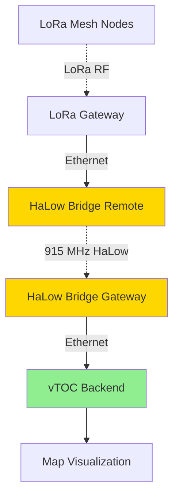

# WiFi HaLow Bridge Kit (Anjielo Wireless Access Point)

## Overview

The WiFi HaLow Bridge Kit from Anjielo provides long-range wireless connectivity using IEEE 802.11ah (WiFi HaLow) technology operating in the sub-1 GHz band. The 2-pack configuration enables point-to-point or point-to-multipoint connections up to 1 km, ideal for bridging network segments across difficult terrain or extending reach to remote sensors and cameras.

**Product Link:** [Anjielo WiFi HaLow Bridge Kit](https://anjielo.com/products/2-pack-wireless-access-point-with-ethernet-port-bridge-kit-outdoor-point-to-point-connection-long-range-upto-1-km-for-ip-camera)

## Capabilities

- **Range:** Up to 1 km line-of-sight (300-500m in urban environments)
- **Frequency:** 902-928 MHz (US ISM band, sub-1 GHz)
- **Data Rate:** Up to 7.8 Mbps (MCS-dependent)
- **Topology:** Point-to-point bridge or point-to-multipoint AP
- **Ethernet:** 10/100 Mbps port for wired device connection
- **PoE:** Passive PoE support (simplifies installation)
- **Encryption:** WPA2/WPA3 security
- **Latency:** 20-50ms typical
- **Weatherproof:** IP65-rated enclosure for outdoor deployment

## Power Requirements

- **Input Voltage:** 12-24V DC (passive PoE) or dedicated adapter
- **Current Draw:** 
  - Idle: 100-150 mA @ 12V
  - Active (transmitting): 300-500 mA @ 12V
  - Peak: 600 mA @ 12V
- **Power Consumption:** 3-7W typical
- **Power Input:** Passive PoE injector (included) or DC barrel jack
- **PoE Standard:** Passive 12-24V (NOT 802.3af/at)

## Hardware Specifications

| Parameter | Specification |
|-----------|--------------|
| **Radio** | IEEE 802.11ah (WiFi HaLow) |
| **Frequency** | 902-928 MHz (US), 863-868 MHz (EU) |
| **TX Power** | Up to 27 dBm (500 mW) |
| **RX Sensitivity** | -98 dBm typical |
| **Antenna** | 5 dBi integrated omnidirectional |
| **Ethernet** | 1× 10/100 Mbps RJ45 |
| **PoE** | Passive PoE input |
| **Enclosure** | IP65 weatherproof |
| **Mounting** | Pole/wall mount bracket (included) |
| **Dimensions** | 120mm × 80mm × 35mm |
| **Weight** | ~200g per unit |
| **Operating Temp** | -20°C to +60°C |
| **LED Indicators** | Power, Link, Activity |

## Deployment Notes

### Kit Contents (2-Pack)

- 2× HaLow wireless access points/bridges
- 2× Passive PoE injectors (12V)
- 2× Power adapters (12V/1A)
- 2× Pole/wall mounting brackets
- 2× Ethernet cables (1m)
- Quick start guide

### Basic Configuration

#### Access Web Interface

1. **Connect via Ethernet:**
   ```
   Default IP: 192.168.1.1 (Unit 1), 192.168.1.2 (Unit 2)
   Username: admin
   Password: admin (change immediately!)
   ```

2. **Navigate to:** `http://192.168.1.1` in web browser

3. **Initial Setup Wizard:**
   - Set device name (e.g., "HALOW-GATEWAY", "HALOW-REMOTE")
   - Configure wireless mode (AP or Client)
   - Set SSID and password
   - Configure IP addressing (static or DHCP)

#### Point-to-Point Bridge Configuration

**Unit 1 (AP Mode - Gateway Side):**
```
Wireless Mode: Access Point (AP)
SSID: VTOC-HALOW-BRIDGE
Channel: Auto (or fixed, e.g., 5)
Security: WPA2-PSK
Password: <strong-password>
TX Power: 27 dBm (max)

Network Mode: Bridge
LAN IP: 192.168.10.1
DHCP Server: Enabled (192.168.10.100-199)
```

**Unit 2 (Client Mode - Remote Side):**
```
Wireless Mode: Client (Station)
Connect to SSID: VTOC-HALOW-BRIDGE
Security: WPA2-PSK
Password: <same-password>
TX Power: 27 dBm (max)

Network Mode: Bridge
LAN IP: DHCP Client (or static 192.168.10.2)
```

#### Point-to-Multipoint Configuration

**Gateway (AP Mode):**
- Configure as AP (same as above)
- Set max clients: 8-10 (typical limit)

**Remote Units (Client Mode):**
- Each configured as client connecting to same SSID
- Assign unique static IPs or use DHCP

### Integration with vTOC

The HaLow bridge extends network reach for vTOC components:

#### Scenario 1: Remote Camera/Sensor Integration


#### Scenario 2: Extended LoRa Gateway Placement



#### Scenario 3: Field Station Backhaul


### Deployment Scenarios

#### Scenario 1: IP Camera Network Extension

- **Problem:** IP cameras 500m from TOC, no conduit/trenching
- **Solution:** HaLow bridge to extend Ethernet over 915 MHz
- **Bandwidth:** Sufficient for 1-2 cameras @ 720p
- **Latency:** Low enough for live monitoring (30-50ms)

#### Scenario 2: Sensor Network Aggregation

- **Problem:** Distributed sensors need Ethernet uplink
- **Solution:** Point-to-multipoint with 5-8 remote bridges
- **Each Remote:** Local Ethernet switch for multiple sensors
- **Gateway:** Single HaLow AP backhauling all traffic

#### Scenario 3: Temporary Event Infrastructure

- **Problem:** Multi-day event, no permanent network
- **Solution:** Rapid deployment with PoE-powered bridges
- **Advantage:** No trenching, weatherproof, relocatable
- **Teardown:** Remove and reuse for next event

## Installation Best Practices

### Site Survey

1. **Check Line of Sight:**
   - Use binoculars or camera zoom to verify clear path
   - Account for Fresnel zone (60% clearance minimum)
   - Plan for seasonal foliage growth

2. **Test at Ground Level:**
   - Power both units, measure RSSI before mounting
   - If weak: Adjust locations or add relay point
   - Target: -70 dBm or better for reliable link

3. **Height Matters:**
   - Raise antennas 3-6m minimum
   - Each meter of height = significant range increase
   - Avoid ground clutter (buildings, vehicles, terrain)

### Physical Installation

1. **Mounting:**
   - Use pole mount (25-50mm diameter)
   - Ensure secure attachment (U-bolts + lock washers)
   - Point antennas toward each other (omni, but aim helps)

2. **Weatherproofing:**
   - IP65 rated, but seal Ethernet cable entry
   - Use outdoor-rated CAT5e/CAT6 cable
   - Drip loop on cable to prevent water ingress
   - Silicone sealant on any exposed connectors

3. **Power:**
   - Use PoE injector (simplifies wiring)
   - Protect injector from weather (indoor or weatherproof box)
   - Grounding: Connect to lightning protection if available

4. **Alignment:**
   - Start with rough visual alignment
   - Fine-tune using RSSI readings in web interface
   - Lock in position once optimal signal achieved

### Link Budget Calculation

Example calculation for 800m link:

```
TX Power: +27 dBm
TX Antenna Gain: +5 dBi
Free Space Path Loss (915 MHz, 800m): -96 dB
RX Antenna Gain: +5 dBi
Cable/Connector Loss: -1 dB
Received Signal: 27 + 5 - 96 + 5 - 1 = -60 dBm

RX Sensitivity: -98 dBm
Link Margin: -60 - (-98) = 38 dB ✓ (Good!)
```

**Target Link Margin:** 15-20 dB minimum for reliable operation

## Troubleshooting

### Weak Signal / Short Range

1. **Obstruction Check:**
   - Verify LOS (use GPS coordinates + mapping software)
   - Check for new obstacles (construction, vegetation)
   - Ensure Fresnel zone clearance

2. **Antenna Issues:**
   - Inspect for physical damage
   - Check antenna connector (corrosion?)
   - Verify antenna orientation (vertical for omni)

3. **Interference:**
   - Scan 915 MHz band for other devices (LoRa, ISM)
   - Try different channels
   - Reduce TX power if overload suspected (rare)

4. **Upgrade Antennas:**
   - Replace 5 dBi omni with 10 dBi directional
   - Sector antenna for point-to-multipoint
   - Yagi for extreme range point-to-point

### Intermittent Connection

1. **Environmental:**
   - Temperature extremes (check operating range)
   - Moisture ingress (reseal cable entry)
   - Power supply instability (add UPS)

2. **Network:**
   - IP conflict (verify static IP assignments)
   - DHCP exhaustion (increase pool size)
   - Loop detection (spanning tree config)

3. **Firmware:**
   - Check for updates (stability improvements)
   - Factory reset and reconfigure
   - Contact manufacturer support

### Low Throughput

1. **Link Quality:**
   - Check RSSI (-70 dBm or better ideal)
   - Reduce TX data rate for reliability (auto-rate may help)
   - Test with iperf3: `iperf3 -c <remote-ip>`

2. **Configuration:**
   - Disable bandwidth-intensive features (QoS, filtering)
   - Ensure bridge mode (not router/NAT)
   - Verify duplex settings (auto or full)

3. **Realistic Expectations:**
   - Max throughput: 7.8 Mbps physical → 4-6 Mbps actual
   - Sufficient for: SD video, sensor data, moderate web
   - Not suitable for: HD video (> 2 streams), large file transfer

## Advanced Features

### VLAN Support (if available)

- Segment traffic (cameras, sensors, management)
- Configure tagged/untagged ports
- Map VLANs to SSIDs (if multiple SSIDs supported)

### QoS (Quality of Service)

- Prioritize time-sensitive traffic (VoIP, video)
- Configure queues (high/medium/low priority)
- Limit bandwidth for non-critical devices

### Monitoring & Management

- SNMP: Monitor link status, traffic stats
- Syslog: Send logs to central server
- SSH: CLI access for scripting (if supported)

## Best Practices

1. **Planning:**
   - Perform site survey before purchasing
   - Use radio planning tools (RadioMobile, CloudRF)
   - Plan for 30-50% range margin (not max rated range)
   - Document IP addressing and SSID/passwords

2. **Security:**
   - Change default admin password immediately
   - Use WPA2 or WPA3 (never WEP or open)
   - Disable unused services (Telnet, HTTP if HTTPS available)
   - Enable MAC filtering for known devices only

3. **Maintenance:**
   - Quarterly inspection (physical condition, LED status)
   - Annual firmware updates
   - Re-check alignment after severe weather
   - Clean antennas (dirt/bird droppings reduce performance)

4. **Backup Configuration:**
   - Export config file (web interface → Backup)
   - Store in secure location
   - Version control (name includes date)
   - Test restore procedure

5. **Redundancy:**
   - Consider dual-path for critical links
   - Keep spare unit on hand (2-pack = 1 deployed, 1 spare)
   - Plan failover to cellular/satellite

## Comparison: HaLow vs. Alternatives

| Technology | Range | Data Rate | Use Case |
|------------|-------|-----------|----------|
| **WiFi HaLow** | 500-1000m | 1-8 Mbps | Video, moderate data |
| **LoRa** | 2-10 km | 0.3-50 kbps | Low-bandwidth telemetry |
| **2.4 GHz WiFi** | 50-200m | 54-600 Mbps | High bandwidth, short range |
| **5 GHz WiFi** | 30-100m | 300-1300 Mbps | Very high bandwidth, very short |

**HaLow Sweet Spot:** Medium range, medium bandwidth (cameras, sensors)

## Related Documentation

- [Heltec HaLow ESP32](HELTEC-HALOW.md) - HaLow-enabled microcontroller
- [Netgear GS105E Switch](NETGEAR-GS105E.md) - Network switch for aggregation
- [Hardware Overview](../HARDWARE.md) - Station hardware architecture
- [Deployment Guide](../DEPLOYMENT.md) - Production deployment procedures

## External Resources

- [Anjielo HaLow Bridge Product Page](https://anjielo.com/products/2-pack-wireless-access-point-with-ethernet-port-bridge-kit-outdoor-point-to-point-connection-long-range-upto-1-km-for-ip-camera)
- [WiFi HaLow Overview](https://www.wi-fi.org/discover-wi-fi/wi-fi-halow)
- [RadioMobile Link Planning](https://www.ve2dbe.com/rmonline_s.asp)
- [Fresnel Zone Calculator](https://www.pasternack.com/t-calculator-fresnel.aspx)
