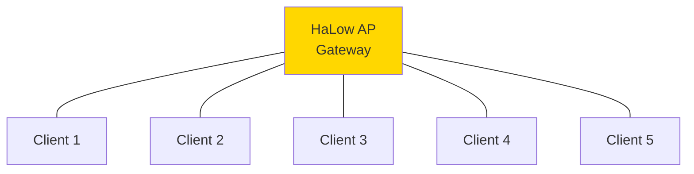
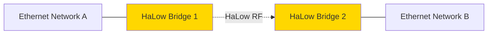
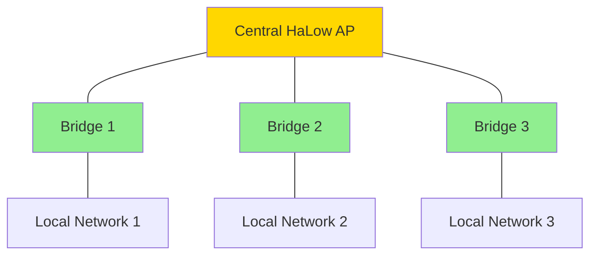

# WiFi HaLow Coverage Planning

## HaLow-Specific Considerations

### Technology Overview

WiFi HaLow (IEEE 802.11ah) operates in sub-1 GHz band (902-928 MHz US):
- Longer range than 2.4/5 GHz WiFi (10x typical)
- Better penetration through walls/foliage
- Lower power consumption
- Standard IP networking (easier integration)

### Coverage Estimation

**Rule of Thumb (915 MHz, 20 dBm TX, 5 dBi antenna):**
- **Line-of-Sight:** 800m-1 km
- **Suburban:** 300-500m
- **Urban:** 200-300m
- **Indoor-to-Outdoor:** 100-200m
- **Through walls:** 50-100m

**Factors:**
- MCS (Modulation and Coding Scheme): Higher MCS = faster but shorter range
- Bandwidth: 1/2/4/8/16 MHz (wider = faster but slightly shorter range)
- Environmental: Buildings, foliage absorb signal

### Link Budget

**Typical HaLow Parameters:**
- TX Power: 20-27 dBm (100-500 mW)
- RX Sensitivity: -98 dBm (MCS0) to -75 dBm (MCS10)
- Antenna Gain: 3-10 dBi (depends on type)

**Example: 915 MHz, MCS2, 500m link**

```
TX Power: +20 dBm
TX Antenna: +5 dBi
Path Loss (500m): -99 dB
RX Antenna: +5 dBi
Cable Loss: -1 dB

RX Power = 20 + 5 - 99 + 5 - 1 = -70 dBm
RX Sensitivity (MCS2): -90 dBm
Link Margin: -70 - (-90) = 20 dB ✓ (Good)
```

### Data Rate vs Range

| MCS | Data Rate | RX Sensitivity | Relative Range |
|-----|-----------|----------------|----------------|
| **MCS0** | 150 kbps | -98 dBm | 100% (max) |
| **MCS2** | 650 kbps | -90 dBm | 60% |
| **MCS4** | 1.95 Mbps | -85 dBm | 40% |
| **MCS7** | 6.5 Mbps | -78 dBm | 20% |
| **MCS10** | 7.8 Mbps | -75 dBm | 15% (min) |

**Planning Rule:**
- Start with MCS0-2 for maximum coverage
- Let AP/client auto-negotiate higher MCS when close
- Reserve high MCS for fixed P2P links with good signal

## Network Topology

### Access Point Mode

Single AP serves multiple clients:



**Pros:**
- Simple configuration
- Standard WiFi behavior (DHCP, etc.)
- Low latency

**Cons:**
- Single point of failure
- Limited by AP capacity (~10-20 clients typical)
- Range limited by AP location

**Use Case:**
- Small deployments
- Sensor networks with fixed AP
- IP camera networks

### Point-to-Point Bridge

Two HaLow bridges extend Ethernet:



**Pros:**
- Transparent Ethernet bridge
- Long range with directional antennas
- No complex routing

**Cons:**
- Single link (no mesh)
- Both ends must have power/mounting

**Use Case:**
- Building-to-building links
- Extend vTOC network across campus
- Remote camera/sensor cluster connection

### Point-to-Multipoint

One AP with multiple remote bridges:



**Pros:**
- Scales better than pure AP mode
- Each bridge can serve local Ethernet devices
- Central management

**Cons:**
- AP throughput shared among all bridges
- Limited to ~10 bridges typically

**Use Case:**
- Multi-building campus
- Distributed sensor networks
- vTOC field stations connecting to TOC

## Antenna Selection

### Omnidirectional (AP/Multi-client)

**5 dBi Omnidirectional:**
- Range: 300-500m typical
- Pattern: 360° horizontal
- Use: Central AP serving area

**9 dBi Collinear:**
- Range: 500-800m typical
- Pattern: 360° horizontal, narrow vertical
- Use: Base station, flat terrain

### Directional (Point-to-Point)

**10 dBi Yagi:**
- Range: 1-2 km LOS
- Beamwidth: 40-50°
- Use: Fixed link, one direction

**14 dBi Panel:**
- Range: 2-3 km LOS
- Beamwidth: 30-40°
- Use: Long-distance P2P, sector coverage

### Sector (Point-to-Multipoint)

**12 dBi 90° Sector:**
- Range: 800m-1.2 km
- Coverage: 90° sector
- Use: AP serving directional area

## Application Examples

### Example 1: IP Camera Network

**Scenario:** 8 outdoor IP cameras, 200-400m from control room

**Design:**
- **AP:** Central HaLow AP (control room)
- **Clients:** 8× HaLow bridges (one per camera)
- **Antennas:** 5 dBi omni (AP), 3 dBi stubby (cameras)
- **Bandwidth:** 720p @ 2 Mbps per camera = 16 Mbps total
- **MCS:** Auto (MCS3-5 expected)

**Coverage:**
- AP at 10m height (building roof)
- Cameras on poles 3m height
- LOS for all cameras
- Link budget: 15-20 dB margin

### Example 2: Sensor Network

**Scenario:** 30 environmental sensors across industrial site

**Design:**
- **AP:** Central HaLow AP
- **Clients:** 30× HaLow-enabled sensor nodes
- **Update:** 1-minute intervals
- **Bandwidth:** 100 bytes/minute per sensor (very low)
- **MCS:** MCS0-2 (maximize range)

**Coverage:**
- Site dimensions: 500m × 500m
- AP centrally located, 15m height
- Omnidirectional antenna
- Edge sensors ~350m from AP

### Example 3: Building-to-Building Link

**Scenario:** vTOC station in Building A, sensors in Building B (800m away)

**Design:**
- **Topology:** Point-to-point bridge
- **Antennas:** 14 dBi panel (both ends)
- **Alignment:** Aimed at each other
- **Bandwidth:** 5 Mbps (video + data)
- **MCS:** MCS5-7

**Link Budget:**
```
TX: +20 dBm
TX Ant: +14 dBi
Path Loss (800m @ 915 MHz): -108 dB
RX Ant: +14 dBi
Cable: -2 dB

RX: 20 + 14 - 108 + 14 - 2 = -62 dBm
Sensitivity (MCS7): -78 dBm
Margin: 16 dB ✓
```

## Planning Tools

### Online Calculators

**WiFi Link Budget Calculator:**
- Input: Frequency, distance, power, gain
- Output: Received power, margin
- Tool: [RF Wireless World](https://www.rfwireless-world.com/calculators/WiFi-Range-Calculator.html)

**HaLow Range Estimator:**
- Proprietary tools from HaLow vendors
- Account for MCS, terrain, environment

### vTOC Python Integration

```python
from mesh_planning.halow import HaLowLinkBudget

link = HaLowLinkBudget(
    freq_mhz=915,
    distance_km=0.5,  # 500m
    tx_power_dbm=20,
    antenna_gain_dbi=5,
    mcs=2,
    environment='suburban'
)

print(f"Margin: {link.margin_db} dB")
print(f"Max throughput: {link.max_throughput_mbps} Mbps")
```

## Integration with vTOC

### IP Camera Streaming

HaLow bridges IP cameras to vTOC backend:

```
Camera → HaLow Client → [RF Link] → HaLow AP → Ethernet → vTOC Backend
```

vTOC receives standard RTSP/HTTP streams, no special handling needed.

### Sensor Data Collection

Sensors with HaLow connectivity POST to vTOC API:

```python
import requests

# Sensor node with HaLow connectivity
data = {
    'sensor_id': 'TEMP-001',
    'temperature': 22.5,
    'humidity': 45,
    'battery': 3.8
}

requests.post('http://vtoc-api/telemetry/sensor', json=data)
```

### Coverage Visualization

Display HaLow coverage on vTOC map:
- Upload HaLow AP locations (GeoJSON)
- Generate coverage circles (500m radius)
- Color-code by link quality (RSSI)

## Related Documentation

- [WiFi HaLow Bridge Kit](../HARDWARE/WIFI-HALOW-BRIDGE.md) - Hardware details
- [Heltec HaLow ESP32](../HARDWARE/HELTEC-HALOW.md) - Development board
- [Mesh Planning Overview](OVERVIEW.md) - General methodology
- [Antenna Systems](../HARDWARE/ANTENNAS.md) - Antenna selection

## External Resources

- [WiFi Alliance - WiFi HaLow](https://www.wi-fi.org/discover-wi-fi/wi-fi-halow)
- [IEEE 802.11ah Standard](https://standards.ieee.org/standard/802_11ah-2016.html)
- [Newracom HaLow Resources](https://www.newracom.com/halow/)
