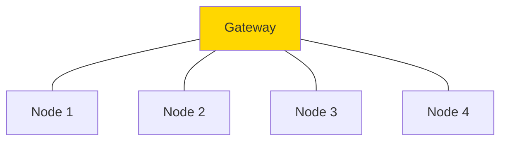
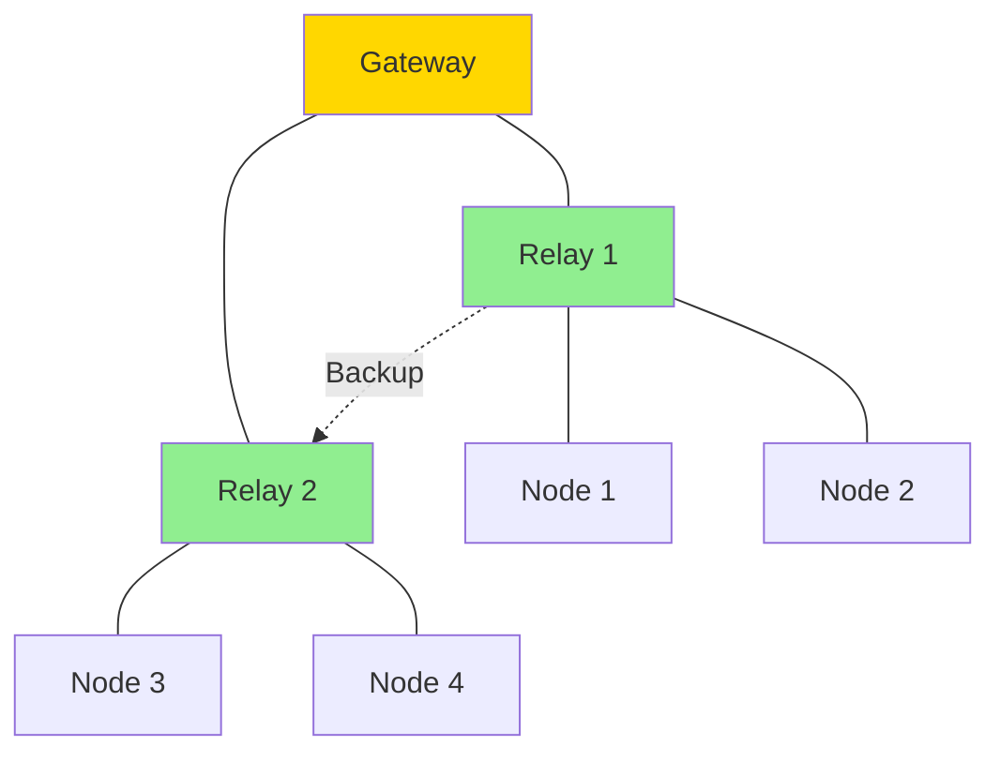

# LoRa Coverage Planning

## LoRa-Specific Considerations

### Spreading Factor (SF) Trade-offs

LoRa uses chirp spread spectrum with configurable spreading factors (SF7-SF12):

| SF | Data Rate | Range | Airtime (50 bytes) | Battery Impact |
|----|-----------|-------|-------------------|----------------|
| **SF7** | 5.47 kbps | Shortest | 56 ms | Lowest |
| **SF8** | 3.13 kbps | ↓ | 103 ms | ↓ |
| **SF9** | 1.76 kbps | ↓ | 205 ms | ↓ |
| **SF10** | 0.98 kbps | ↓ | 371 ms | ↓ |
| **SF11** | 0.54 kbps | ↓ | 741 ms | ↓ |
| **SF12** | 0.29 kbps | Longest | 1483 ms | Highest |

**Planning Implication:**
- Close nodes: Use SF7 (fast, efficient)
- Far nodes: Use SF12 (slow, long range)
- ADR (Adaptive Data Rate): Auto-adjust per node

### Link Budget for LoRa

**Typical LoRa Parameters:**
- TX Power: 14-20 dBm (25-100 mW)
- RX Sensitivity: -137 dBm (SF12) to -123 dBm (SF7)
- Bandwidth: 125 kHz (typical), 250/500 kHz (higher rate)
- Coding Rate: 4/5 (typical)

**Example: 915 MHz, SF10, 5 km link**

```
TX Power: +20 dBm
TX Antenna: +3 dBi (stubby)
Path Loss (5 km): -113 dB
RX Antenna: +3 dBi (stubby)
Cable Loss: -2 dB

RX Power = 20 + 3 - 113 + 3 - 2 = -89 dBm
RX Sensitivity (SF10): -130 dBm
Link Margin: -89 - (-130) = 41 dB ✓ (Excellent!)
```

**With Obstructions:**
Add 10-30 dB loss for buildings, foliage:
- Urban: -89 + (-20) = -109 dBm, margin = 21 dB (Still good)
- Heavy urban: -89 + (-30) = -119 dBm, margin = 11 dB (Acceptable)

### Coverage Estimation

**Rule of Thumb (915 MHz, SF10, 20 dBm TX):**
- **Rural/Open:** 8-10 km
- **Suburban:** 4-6 km
- **Urban:** 2-3 km
- **Dense Urban:** 1-2 km
- **Indoor-to-Outdoor:** 500m-1 km

**Factors:**
- Antenna height (each meter helps significantly)
- Antenna gain (directional = longer range one direction)
- Terrain (LOS vs. NLOS)
- Interference (ISM band is crowded)

### Duty Cycle Limits

**Regulatory Constraints (US 915 MHz):**
- FCC Part 15.247: Transmit < 400ms per transmission
- No explicit duty cycle (unlike EU)

**EU 868 MHz:**
- ETSI: 1% duty cycle in 868 MHz band
- 36 seconds transmit per hour maximum
- Constrains update rate for mesh

**Design Around Duty Cycle:**
```
Packet airtime: 200ms (SF10, 50 bytes)
Max packets/hour (1% duty cycle): 3600s / 200ms * 0.01 = 180 packets/hour
Update interval: 3600s / 180 = 20 seconds minimum
```

**Solution:**
- Increase payload size (amortize overhead)
- Use lower SF when possible (faster = less airtime)
- Stagger node transmissions (TDMA-like)

### Mesh Topology Planning

**Star Topology (Single Gateway):**


- **Pros:** Simple, low latency
- **Cons:** Gateway overload, single point of failure
- **Use:** Small deployments (< 20 nodes)

**Mesh Topology (Multi-Hop):**


- **Pros:** Scalable, fault-tolerant
- **Cons:** Routing overhead, increased latency
- **Use:** Large deployments (> 20 nodes)

**Relay Node Placement:**
1. Gateway at center or highest point
2. Relay nodes at strategic locations (line-of-sight to gateway + edge)
3. Maximum 5-7 hops (latency, reliability)
4. Redundant paths (if relay fails, alternate route available)

## Planning Tools

### LoRa Airtime Calculator

Calculate packet transmission time:

```
Airtime = Preamble + Header + Payload
```

Online tools:
- [LoRa Airtime Calculator](https://www.loratools.nl/#/airtime)
- Specify SF, BW, CR, payload size
- Outputs: Airtime, time-on-air, duty cycle impact

**Example:**
- SF10, BW 125 kHz, CR 4/5, Payload 50 bytes
- Airtime: 371 ms
- Max messages/hour (1% duty cycle): 9.7 messages

### Coverage Simulators

**RadioMobile (Desktop):**
1. Define transmitter: Lat/lon, height, power, antenna
2. Set receiver sensitivity: -130 dBm (SF12)
3. Run coverage analysis
4. Export KML for vTOC map overlay

**CloudRF (Web):**
1. Create account (free tier available)
2. Input transmitter parameters
3. Select ITU propagation model
4. Generate heatmap (signal strength in dBm)

### vTOC Python Tools

**Link Budget Calculator:**
```python
from mesh_planning.lora import LoRaLinkBudget

link = LoRaLinkBudget(
    freq_mhz=915,
    distance_km=5,
    tx_power_dbm=20,
    spreading_factor=10,
    antenna_gain_tx_dbi=3,
    antenna_gain_rx_dbi=3,
    environment='suburban'
)

print(f"Link Margin: {link.margin_db:.1f} dB")
print(f"Recommended SF: {link.recommended_sf}")
```

**Mesh Network Optimizer:**
```python
from mesh_planning.lora import MeshOptimizer

nodes = [
    {'id': 'N1', 'lat': 42.36, 'lon': -71.05, 'type': 'gateway'},
    {'id': 'N2', 'lat': 42.37, 'lon': -71.06, 'type': 'relay'},
    # ... more nodes
]

optimizer = MeshOptimizer(nodes)
optimizer.optimize_topology()
optimizer.export_geojson('mesh_topology.geojson')
```

## Real-World Examples

### Example 1: Agricultural Monitoring

**Scenario:** 500-hectare farm, 25 soil sensors

**Design:**
- **Gateway:** Farmhouse (central, wired internet)
- **Frequency:** 915 MHz
- **SF:** SF9 (balance range/battery)
- **Update:** 15-minute intervals
- **Topology:** Star (all sensors direct to gateway)

**Coverage:**
- Max distance: 3 km (farm perimeter)
- Antenna: 5 dBi collinear on farmhouse roof (6m height)
- Link budget: 25 dB margin (robust)

**Battery Life:**
- 18650 Li-ion (3000 mAh)
- 15-min updates, SF9: ~6 months battery life

### Example 2: Wildfire Monitoring Network

**Scenario:** 100 km² forest, 50 temperature/smoke sensors

**Design:**
- **Gateways:** 2× (redundancy), LTE backhaul
- **Frequency:** 915 MHz
- **SF:** SF11/SF12 (long range)
- **Update:** 30-minute intervals (normal), 5-min (alert)
- **Topology:** Mesh (multi-hop through relay nodes)

**Coverage:**
- **Relay Nodes:** 4× on hilltops (solar powered)
- **Max hop count:** 3 hops to gateway
- **Antenna:** 9 dBi collinear on relay nodes (10m masts)

**Fault Tolerance:**
- Each sensor sees 2+ nodes (redundant paths)
- If gateway fails, switch to backup

## Integration with vTOC

### Position Reporting

LoRa nodes transmit NMEA-like position strings:

```
$LORA,N001,42.3601,-71.0589,15,0,85*CHK
```

Parsed by AgentKit connector:
```python
def parse_lora_position(message):
    parts = message.split(',')
    return {
        'node_id': parts[1],
        'latitude': float(parts[2]),
        'longitude': float(parts[3]),
        'altitude': int(parts[4]),
        'speed': int(parts[5]),
        'battery': int(parts[6])
    }
```

### Mesh Visualization

vTOC map displays:
- Node positions (real-time)
- Link quality (RSSI color-coded)
- Mesh topology (lines between nodes)
- Coverage areas (heatmap overlay)

### Alerts

Configure alerts for:
- Node offline (no update > threshold)
- Low battery (< 20%)
- Poor link quality (RSSI < -100 dBm)
- Mesh partition (network split detected)

## Related Documentation

- [Mesh Planning Overview](OVERVIEW.md) - General mesh planning methodology
- [LoRa MANET Node](../HARDWARE/LORA-MANET.md) - Hardware details
- [Antenna Systems](../HARDWARE/ANTENNAS.md) - Antenna selection
- [Python Planning Tools](PYTHON-TOOLS.md) - vTOC planning scripts

## External Resources

- [LoRa Alliance](https://lora-alliance.org/)
- [LoRa Airtime Calculator](https://www.loratools.nl/#/airtime)
- [Semtech AN1200.13](https://www.semtech.com/uploads/documents/an1200.13.pdf) - Link Budget
- [Meshtastic Docs](https://meshtastic.org/docs/overview) - Open-source LoRa mesh
