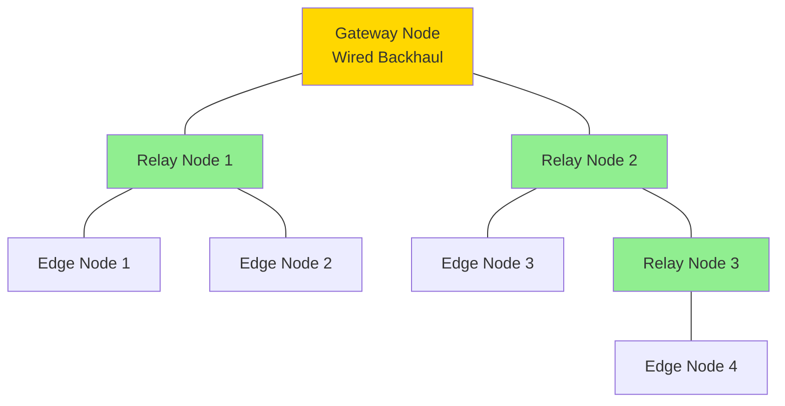

# Geospatial Mesh Network Planning Overview

## Introduction

Effective mesh network deployment requires careful planning of node placement, coverage areas, and link budgets. This guide provides methodologies, tools, and workflows for planning LoRa, WiFi HaLow, and SDR coverage in vTOC operations.

## Planning Fundamentals

### Radio Propagation Basics

**Line-of-Sight (LOS):**
- VHF/UHF/Sub-GHz primarily line-of-sight
- Obstacles (buildings, terrain, vegetation) significantly attenuate signals
- Fresnel zone clearance required for reliable links

**Fresnel Zone:**
- Ellipsoid between transmitter and receiver
- First Fresnel zone: Most critical (contains 50% of energy)
- Rule: 60% clearance minimum for reliable link
- Radius at midpoint:

```
Radius (m) = 17.3 × √(distance_km / (4 × frequency_GHz))
```

**Example: 915 MHz, 1 km link**
```
Radius = 17.3 × √(1 / (4 × 0.915)) = 9.0 meters
60% clearance = 5.4 meters at midpoint
```

**Implication:** Antennas must be high enough to clear obstacles + Fresnel zone

### Path Loss

Free-space path loss (FSPL) in dB:

```
FSPL (dB) = 20 × log10(distance_km) + 20 × log10(frequency_MHz) + 32.45
```

**Example Calculations:**

| Distance | 433 MHz | 915 MHz | 2.4 GHz |
|----------|---------|---------|---------|
| **100m** | 72 dB | 78 dB | 88 dB |
| **1 km** | 92 dB | 98 dB | 108 dB |
| **5 km** | 106 dB | 112 dB | 122 dB |
| **10 km** | 112 dB | 118 dB | 128 dB |

**Additional Losses:**
- Urban clutter: +5 to 20 dB
- Foliage: +5 to 10 dB per tree line
- Building penetration: +10 to 30 dB per wall
- Weather (heavy rain): +1 to 5 dB

### Coverage Patterns

**Omnidirectional Antenna:**
- Circular coverage (horizontal plane)
- Range determined by antenna height and terrain
- Use for base stations, mobile nodes

**Directional Antenna:**
- Sector or beam coverage
- Longer range in pointed direction
- Use for point-to-point links, relay nodes

**Elevation Angle:**
- Low angle: Propagates along horizon (long range)
- High angle: Propagates upward (near-field, overhead)
- High-gain antennas have narrower vertical beamwidth

## Planning Process

### 1. Define Requirements

**Mission Parameters:**
- Coverage area (geographic boundaries)
- Number of mobile nodes (personnel, vehicles, drones)
- Data requirements (bandwidth, latency, update rate)
- Duration (temporary event vs. permanent installation)
- Environment (urban, rural, mountainous, maritime)

**Performance Targets:**
- Minimum link margin: 10-15 dB
- Coverage probability: 90-95% (statistical)
- Maximum latency: 500ms typical (mesh routing)
- Node density: 1 node per X km² (depends on topology)

### 2. Terrain Analysis

**Tools:**
- **Google Earth:** Quick visual survey, elevation profile
- **QGIS + DEM data:** Detailed topographic analysis
- **USGS National Map:** Free elevation data (US)
- **OpenStreetMap:** Building footprints, land use

**Workflow:**
1. Import coverage area into GIS software
2. Load Digital Elevation Model (DEM) for terrain
3. Identify high points (candidate node locations)
4. Identify low points (potential dead zones)
5. Note obstructions (buildings, forests)

### 3. Node Placement

**Strategy:**

**Gateway Nodes:**
- Highest elevation in coverage area
- Wired backhaul (Ethernet, fiber, or high-capacity wireless)
- Redundant gateways for fault tolerance (2+ recommended)
- Central location for minimum hop count

**Relay Nodes:**
- Line-of-sight to at least 2 other nodes (redundancy)
- Placed to fill coverage gaps
- Height above ground clutter (3-10m minimum)
- Consider accessibility (maintenance)

**Edge Nodes:**
- Mobile users, sensors, remote sites
- Typically client-only (not relaying)
- Battery-powered or vehicle-powered

**Topology Considerations:**



**Design Rules:**
- Minimum 2 paths to gateway (redundancy)
- Maximum hop count: 5-7 hops (latency, reliability)
- Avoid single point of failure (bridge nodes)

### 4. Link Budget Analysis

For each link, calculate:

```
RX Power (dBm) = TX Power + TX Ant Gain - Path Loss + RX Ant Gain - Cable Loss - Margin
```

**Target:**
- Received power > RX sensitivity + 10 dB margin

**Adjust:**
- Increase antenna gain (higher gain antennas)
- Increase TX power (if regulatory allows)
- Reduce path loss (raise antennas, relocate)
- Improve cable (lower loss coax)

### 5. Coverage Mapping

**Tools:**
- **RadioMobile Online:** Free, web-based RF planning
- **CloudRF:** Advanced propagation modeling (paid)
- **Splat!:** Open-source terrain analysis
- **QGIS + RF plugins:** Custom GIS-based planning

**Process:**
1. Define transmitter location (lat/lon/height)
2. Set transmit power, antenna gain, frequency
3. Run propagation model (ITM, Longley-Rice, etc.)
4. Generate coverage heatmap
5. Identify gaps, add relay nodes
6. Iterate until coverage target met

### 6. Field Validation

**Site Survey:**
- Visit candidate node locations
- Verify line-of-sight (binoculars, laser rangefinder)
- Test link with portable equipment
- Measure actual signal strength (compare to model)
- Document site conditions (photos, GPS coordinates)

**Pre-Deployment Test:**
- Setup temporary nodes
- Test throughput, latency, packet loss
- Map actual coverage (drive test)
- Adjust plan based on real-world results

## Technology-Specific Planning

### LoRa Mesh Networks

See: [LoRa Coverage Planning](LORA-COVERAGE.md)

**Characteristics:**
- Range: 2-10 km (terrain dependent)
- Bandwidth: 0.3-50 kbps (spreading factor)
- Latency: 100-500ms (+ routing delay)
- Use case: Low-bandwidth telemetry, tracking

**Planning Considerations:**
- Duty cycle limits (1% for unlicensed ISM)
- Adaptive data rate (trade speed for range)
- Mesh routing overhead
- Battery life vs. update rate

### WiFi HaLow Networks

See: [HaLow Coverage Planning](HALOW-COVERAGE.md)

**Characteristics:**
- Range: 500m-1km (LOS)
- Bandwidth: 150 kbps - 7.8 Mbps
- Latency: 20-50ms
- Use case: Video, sensors, moderate bandwidth

**Planning Considerations:**
- Higher bandwidth than LoRa (more data)
- Shorter range than LoRa
- Standard IP networking (easier integration)
- Access point capacity limits

### SDR Coverage

See: [SDR Coverage Planning](SDR-COVERAGE.md)

**Characteristics:**
- Range: Depends on frequency and power
- Bandwidth: Wide (spectrum monitoring)
- Use case: ADS-B, ACARS, ISM monitoring

**Planning Considerations:**
- Receiver-only (no transmit planning)
- Antenna height critical (aircraft LOS)
- Filter requirements (prevent overload)
- Timing (GPS for multi-sensor TDOA)

## Integration with vTOC

### Map Layer Visualization

vTOC's Leaflet-based map can display planning outputs:

**Coverage Heatmaps:**
- Import GeoJSON or KML from planning tools
- Color-code by signal strength (RSSI)
- Toggle layers per frequency/technology

**Node Locations:**
- Plot planned node positions
- Label with node ID, type (gateway/relay/edge)
- Show LOS links between nodes

**Example GeoJSON:**
```json
{
  "type": "FeatureCollection",
  "features": [
    {
      "type": "Feature",
      "geometry": {
        "type": "Point",
        "coordinates": [-71.0589, 42.3601]
      },
      "properties": {
        "name": "Gateway-001",
        "type": "gateway",
        "antenna_height_m": 10,
        "frequency_mhz": 915
      }
    }
  ]
}
```

### Python Tooling

vTOC repository includes Python utilities for planning:

**Link Budget Calculator:**
```python
# Example: scripts/rf_planning/link_budget.py
from rf_planning import LinkBudget

link = LinkBudget(
    freq_mhz=915,
    distance_km=5,
    tx_power_dbm=20,
    tx_ant_gain_dbi=5,
    rx_ant_gain_dbi=5,
    cable_loss_db=2
)

print(f"Path Loss: {link.path_loss_db:.1f} dB")
print(f"Received Power: {link.rx_power_dbm:.1f} dBm")
print(f"Link Margin: {link.link_margin_db:.1f} dB")
```

**Coverage Area Calculator:**
```python
# Example: scripts/rf_planning/coverage.py
from rf_planning import CoverageArea

area = CoverageArea(
    center_lat=42.3601,
    center_lon=-71.0589,
    freq_mhz=915,
    tx_power_dbm=20,
    ant_gain_dbi=5,
    ant_height_m=10,
    rx_sensitivity_dbm=-110
)

# Generate coverage polygon (GeoJSON)
coverage_geojson = area.generate_coverage()
```

**Fresnel Zone Checker:**
```python
# Example: scripts/rf_planning/fresnel.py
from rf_planning import FresnelZone

fz = FresnelZone(
    freq_mhz=915,
    distance_km=5,
    clearance_percent=60
)

print(f"First Fresnel radius at midpoint: {fz.radius_m:.1f} m")
print(f"Required clearance: {fz.clearance_m:.1f} m")
```

See: [Python Planning Tools](PYTHON-TOOLS.md)

## Example Workflows

### Workflow 1: Urban Event Coverage

**Scenario:** 3-day festival, 1 km² area, 500 attendees

**Requirements:**
- Track 50 staff members (GPS trackers)
- Monitor 10 security cameras (WiFi HaLow)
- Command post at event center

**Planning Steps:**

1. **Terrain:** Flat urban park, buildings on perimeter
2. **Technology:** WiFi HaLow (video bandwidth)
3. **Nodes:**
   - 1× Gateway (command post, wired to internet)
   - 4× Relay nodes (corners of coverage area, elevated 3m)
   - 50× Mobile trackers (staff)
   - 10× Fixed cameras (HaLow client + camera)

4. **Link Budget:**
   - Gateway to relay: 300m, expect -70 dBm (good)
   - Relay to camera: 200m, expect -65 dBm (good)
   - Relay to tracker: 500m, expect -80 dBm (marginal, acceptable for tracking)

5. **Coverage Map:** RadioMobile simulation shows 95% coverage

6. **Deployment:** Setup day before, test all links

### Workflow 2: Rural Search and Rescue

**Scenario:** Mountain SAR operation, 50 km² search area

**Requirements:**
- Track 20 SAR team members
- Low bandwidth (position only, text messaging)
- 24-48 hour operation

**Planning Steps:**

1. **Terrain:** Mountainous, elevation range 500-1500m
2. **Technology:** LoRa mesh (long range, low power)
3. **Nodes:**
   - 1× Gateway (command post, LTE backhaul)
   - 2× Relay nodes (mountain peaks, solar powered)
   - 20× Mobile nodes (SAR personnel)

4. **Link Budget:**
   - Gateway to relay: 10 km, need high gain Yagi (15 dBi)
   - Relay to mobile: 5 km, omnidirectional acceptable

5. **Coverage Map:** Relays on peaks provide LOS to valleys

6. **Contingency:** Portable relay node (carried by team to fill gaps)

### Workflow 3: Maritime Port Security

**Scenario:** Port facility, 5 km waterfront, 2 km inland

**Requirements:**
- Monitor perimeter sensors (motion, cameras)
- Track patrol vehicles
- 24/7 operation, hardened infrastructure

**Planning Steps:**

1. **Terrain:** Flat, open water (good propagation), metal containers (multipath)
2. **Technology:** Mixed (WiFi HaLow for cameras, LoRa for sensors)
3. **Nodes:**
   - 2× Gateway (redundant, fiber backhaul)
   - 6× Relay nodes (towers/buildings, 10-15m height)
   - 50× Sensors (LoRa, battery + solar)
   - 20× Cameras (HaLow, PoE powered)
   - 10× Vehicles (LoRa + GPS)

4. **Link Budget:** Conservative (maritime environment corrosive)
5. **Redundancy:** Every node sees 3+ other nodes
6. **Maintenance:** Quarterly antenna inspection (salt spray)

See: [PR-CYBR Division Workflows](DIVISION-WORKFLOWS.md)

## Common Pitfalls

### Underestimating Terrain

**Problem:** Plan looks good on flat map, fails in real world

**Solution:**
- Always use DEM (digital elevation model)
- Generate elevation profiles for key links
- Assume additional 10-20 dB loss for hilly terrain

### Ignoring Fresnel Zones

**Problem:** Antennas have LOS but link marginal/unreliable

**Solution:**
- Calculate Fresnel zone radius
- Ensure 60% clearance at all points
- Raise antennas or relocate to clear obstructions

### Overloading Gateway

**Problem:** All nodes route through single gateway (bottleneck)

**Solution:**
- Deploy multiple gateways
- Load balance (split coverage area)
- Use mesh routing (nodes relay for others)

### Poor Antenna Selection

**Problem:** Wrong antenna gain for application

**Solution:**
- Omnidirectional for mobile/mesh
- Directional for P2P links only
- Match beamwidth to coverage requirement

### Neglecting Maintenance Access

**Problem:** Nodes placed in inaccessible locations

**Solution:**
- Plan for maintenance (battery replacement, repairs)
- Document access procedures (keys, permissions)
- Prefer accessible locations even if suboptimal RF

### Unrealistic Link Budgets

**Problem:** Optimistic assumptions lead to poor coverage

**Solution:**
- Use conservative margin (15-20 dB)
- Account for fading (weather, multipath)
- Field test before deployment

## Related Documentation

- [LoRa Coverage Planning](LORA-COVERAGE.md) - LoRa-specific methodology
- [HaLow Coverage Planning](HALOW-COVERAGE.md) - WiFi HaLow planning
- [SDR Coverage Planning](SDR-COVERAGE.md) - SDR receiver placement
- [Python Planning Tools](PYTHON-TOOLS.md) - vTOC planning scripts
- [Division Workflows](DIVISION-WORKFLOWS.md) - PR-CYBR example deployments
- [Antenna Systems](../HARDWARE/ANTENNAS.md) - Antenna selection and installation

## External Resources

- [RadioMobile Online](https://www.ve2dbe.com/rmonline_s.asp) - Free RF planning tool
- [CloudRF](https://cloudrf.com/) - Advanced propagation modeling
- [Splat!](https://www.qsl.net/kd2bd/splat.html) - Open-source terrain analysis
- [ITU Propagation Models](https://www.itu.int/en/ITU-R/study-groups/rsg3/Pages/iono-tropo-spheric.aspx)
- [LoRa Range Calculator](https://www.loratools.nl/#/airtime)
