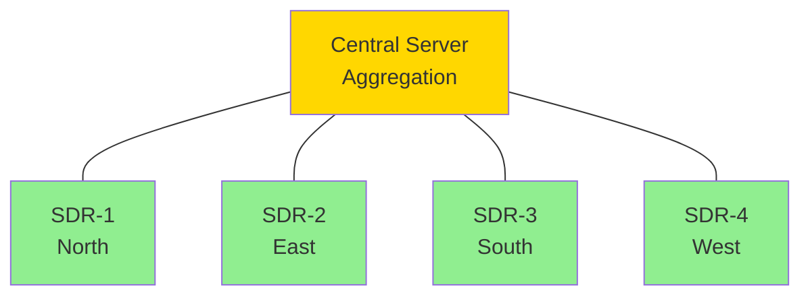

# SDR Coverage Planning

## Introduction

Software-Defined Radio (SDR) coverage planning for vTOC operations focuses on optimizing the placement and configuration of SDR receivers to maximize signal collection across the area of operations. Unlike transmitting mesh nodes, SDR receivers are receive-only systems designed to monitor specific frequency ranges for aviation (ADS-B, ACARS), maritime (AIS), or general spectrum intelligence.

## SDR Receiver Characteristics

### RTL-SDR (RTL2832U-based)

**Frequency Range:** 24 MHz – 1.7 GHz (with gaps)

**Typical Use Cases:**
- ADS-B (1090 MHz)
- ACARS (VHF: 131.550, 131.725, 131.850 MHz)
- Marine VHF (156-162 MHz)
- ISM band monitoring (433 MHz, 915 MHz)

**Sensitivity:** ~-100 dBm typical (varies by frequency)

**Coverage:**
- **Aircraft (ADS-B):** Line-of-sight dependent, 100-300 km range at cruise altitude
- **Ground signals:** 5-10 km for VHF/UHF depending on antenna height and terrain

### HackRF One

**Frequency Range:** 1 MHz – 6 GHz

**Use Cases:**
- Wideband spectrum analysis
- Multi-band monitoring
- Signal identification and characterization

**Coverage:** Similar to RTL-SDR but with wider frequency flexibility

### BladeRF

**Frequency Range:** 300 MHz – 3.8 GHz

**Use Cases:**
- High-performance SDR applications
- Multi-channel reception
- Advanced signal processing

## Coverage Planning Methodology

### 1. Define Monitoring Objectives

**Frequency Bands of Interest:**
- Aviation: 118-137 MHz (voice), 1090 MHz (ADS-B)
- Maritime: 156-162 MHz (VHF), 161.975 MHz (AIS)
- ISM: 433 MHz, 915 MHz
- Custom bands based on mission requirements

**Signal Types:**
- Digital modes (ADS-B, AIS)
- Analog voice (VHF/UHF)
- Data links (ACARS, APRS)
- Unknown signals (spectrum survey)

**Coverage Goals:**
- Geographic area to monitor
- Altitude coverage for airborne signals
- Time-on-target requirements

### 2. Terrain Analysis for Line-of-Sight

**High-Altitude Signals (Aircraft):**
- Aircraft at 30,000 feet (9,144 m) altitude
- Line-of-sight distance to ground receiver:

```
Distance (km) ≈ 3.57 × √(height_m)
Distance (km) ≈ 3.57 × √9144 ≈ 341 km (theoretical maximum)
```

**Practical Range:** 100-250 km due to:
- Antenna gain limitations
- Receiver sensitivity
- Atmospheric conditions
- Terrain masking at low angles

**Ground-Level Signals:**
- Require elevated antenna positions
- Line-of-sight critical (buildings, terrain block signals)
- Use same terrain analysis as mesh planning (see [Planning Overview](OVERVIEW.md))

### 3. Antenna Placement

**Height Requirements:**

**For Aircraft Monitoring (ADS-B):**
- Minimum: 3-5 meters above ground clutter
- Optimal: 10-20 meters (roof-mounted or tower)
- Goal: Clear 360° horizon view down to 1-2° elevation angle

**For Ground Signals (VHF/UHF):**
- Height dictated by local terrain and clutter
- Urban: 5-15 meters to clear buildings
- Rural: 3-5 meters adequate
- Use viewshed analysis (QGIS, Google Earth)

**Antenna Types:**

| Application | Antenna Type | Gain | Beamwidth |
|-------------|--------------|------|-----------|
| **ADS-B (1090 MHz)** | Collinear vertical | 5-8 dBi | 360° H, narrow V |
| **VHF (118-174 MHz)** | Discone or vertical | 0-3 dBi | 360° omnidirectional |
| **AIS (162 MHz)** | Marine VHF vertical | 3-6 dBi | 360° omnidirectional |
| **ISM (433/915 MHz)** | Dipole or ground plane | 2-5 dBi | 360° omnidirectional |
| **Directional (P2P)** | Yagi or log-periodic | 10-15 dBi | 30-60° beamwidth |

**Mounting Considerations:**
- Weather protection (SDR enclosure, antenna radome)
- Lightning protection (grounding, surge arrestors)
- Cable loss minimization (short runs, quality coax)
- Accessibility for maintenance

### 4. Coverage Area Calculation

**Aircraft Coverage (ADS-B Example):**

Assumptions:
- Receiver at 10 m elevation
- Aircraft at 10,000 m (33,000 ft)
- Antenna gain: 5 dBi
- Receiver sensitivity: -100 dBm

**Line-of-Sight Distance:**
```
Distance = 3.57 × (√10 + √10000) ≈ 368 km
```

**Practical Range:** ~200-250 km (due to atmospheric loss and low-angle masking)

**Ground Signal Coverage (VHF at 150 MHz):**

Assumptions:
- Transmitter: 5W (37 dBm), 0 dBi antenna, at ground level
- Receiver: 10 m height, 3 dBi antenna
- Sensitivity: -110 dBm

**Path Loss at 10 km:**
```
FSPL = 20 × log10(10) + 20 × log10(150) + 32.45
     = 20 + 43.5 + 32.45 = 95.95 dB
```

**Link Budget:**
```
RX Power = 37 (TX) + 0 (TX ant) - 95.95 (path) + 3 (RX ant)
         = -55.95 dBm
```

**Margin:** -55.95 - (-110) = 54 dB (excellent, can extend range further)

**Ground Coverage Radius:** ~20-30 km (line-of-sight limited, not power limited)

### 5. Multi-Receiver Deployment

**Overlapping Coverage:**
- Deploy multiple receivers to cover larger areas
- Overlap regions for redundancy and TDOA (time-difference-of-arrival) localization

**TDOA Positioning:**
- Requires synchronized receivers (GPS timing)
- Triangulates signal source location by comparing arrival times
- Minimum 3 receivers (better with 4+)
- Baseline separation: 10-50 km optimal

**Receiver Network Topology:**



**Coverage Optimization:**
- Place receivers at high points (terrain analysis)
- Distribute to minimize overlapping dead zones
- Consider prevailing signal directions (e.g., flight paths for ADS-B)

### 6. Interference and Filtering

**Common Interference Sources:**
- Strong local transmitters (FM broadcast, cellular)
- Harmonics and intermodulation products
- Broadband noise from electronics (USB, computer)

**Mitigation Strategies:**
- **Bandpass filters:** Limit receiver bandwidth to signal of interest
- **LNA (low-noise amplifier):** Improves weak signal reception (place at antenna)
- **Notch filters:** Reject specific strong interferers
- **Spatial separation:** Move SDR away from noise sources
- **Shielding:** Metal enclosures for SDR and cables

**Filter Examples:**
- 1090 MHz SAW filter for ADS-B (rejects out-of-band signals)
- VHF bandpass filter for ACARS (118-137 MHz passband)

## Integration with vTOC

### Telemetry Ingestion

SDR receivers connect to vTOC via telemetry connectors:

**ADS-B:**
- Software: `dump1090`, `readsb`
- Output: JSON over HTTP or raw Mode S
- vTOC endpoint: `/api/v1/telemetry/adsb`

**AIS:**
- Software: `rtl_ais`, `gnuais`
- Output: NMEA sentences
- vTOC endpoint: `/api/v1/telemetry/ais`

**ACARS:**
- Software: `acarsdec`, `dumpvdl2`
- Output: JSON
- vTOC endpoint: `/api/v1/telemetry/acars`

See [ADS-B Integration](../ADSB.md) for detailed configuration.

### Coverage Visualization

**GeoJSON Export:**
- Generate coverage polygons from planning tools
- Import into vTOC map as layers
- Color-code by signal type or receiver ID

**Real-Time Signal Strength:**
- Plot received signal strength (RSSI) on map
- Identify coverage gaps and dead zones
- Adjust receiver placement or antenna gain

**Example GeoJSON:**
```json
{
  "type": "FeatureCollection",
  "features": [
    {
      "type": "Feature",
      "geometry": {
        "type": "Polygon",
        "coordinates": [[
          [-71.0589, 42.3601],
          [-71.0589, 42.5601],
          [-70.8589, 42.5601],
          [-70.8589, 42.3601],
          [-71.0589, 42.3601]
        ]]
      },
      "properties": {
        "sdr_id": "sdr-adsb-001",
        "frequency_mhz": 1090,
        "signal_type": "ADS-B",
        "estimated_range_km": 200
      }
    }
  ]
}
```

### Data Fusion

**Multi-Sensor Correlation:**
- Combine ADS-B from multiple receivers (extended range)
- Correlate AIS and radar tracks (maritime ops)
- Cross-reference ACARS messages with ADS-B positions

**TDOA Localization:**
- Use synchronized SDR receivers (GPS time)
- Calculate transmitter location from time differences
- Integrate with map overlays for geolocation

## Operational Workflows

### Scenario 1: Urban ADS-B Monitoring

**Objective:** Monitor aircraft over major metropolitan area (50 km radius)

**Deployment:**
1. Single SDR receiver (RTL-SDR or AirSpy) with 1090 MHz ADS-B antenna
2. Roof mount (15-20 m elevation) with clear horizon
3. Bandpass filter (1090 MHz SAW) to reject cellular interference
4. LNA at antenna (improves sensitivity by 15-20 dB)

**Expected Coverage:** 150-200 km for high-altitude aircraft, 50-80 km for low-altitude

**Software Stack:**
- `readsb` (decoder)
- vTOC backend API (ingestion)
- Frontend map display (aircraft tracks)

### Scenario 2: Multi-Site ADS-B Network

**Objective:** Cover 500 km² region with redundant coverage

**Deployment:**
1. 4× SDR receivers at cardinal directions (North, East, South, West)
2. High-ground placements (terrain analysis in QGIS)
3. GPS timing for synchronization (TDOA capable)
4. Networked via VPN (Tailscale or ZeroTier)

**Expected Coverage:** 95%+ area coverage with overlapping zones

**Advantages:**
- Redundancy (receiver failure doesn't create coverage gaps)
- Extended range (combine detections from multiple sites)
- TDOA localization (experimental)

### Scenario 3: Maritime AIS Monitoring

**Objective:** Monitor ship traffic in coastal waters (50 km offshore)

**Deployment:**
1. RTL-SDR with marine VHF antenna (AIS: 161.975, 162.025 MHz)
2. Coastal high point (tower, lighthouse, hilltop)
3. 10-20 m antenna height for line-of-sight to horizon

**Expected Coverage:** 30-50 km offshore (line-of-sight to sea surface)

**Software Stack:**
- `rtl_ais` or `gnuais`
- vTOC telemetry API (AIS connector)
- Map overlays with ship tracks

## Tools and Resources

### Coverage Prediction Tools

**RadioMobile Online:**
- Free web-based tool
- Terrain-aware propagation modeling
- Supports custom receiver heights and gains
- URL: https://www.ve2dbe.com/rmonline_s.asp

**CloudRF:**
- Advanced propagation modeling (ITM, Longley-Rice)
- API access for automation
- Paid service
- URL: https://cloudrf.com/

**Splat!:**
- Open-source terrain analysis
- Generates KML/GeoJSON outputs
- CLI-based (Linux)
- URL: https://www.qsl.net/kd2bd/splat.html

### SDR Software

**ADS-B:**
- `dump1090` (original)
- `readsb` (improved fork)
- `dump978` (ADS-B UAT for US)

**AIS:**
- `rtl_ais` (simple)
- `gnuais` (advanced)

**ACARS:**
- `acarsdec` (VHF ACARS)
- `dumpvdl2` (VDL Mode 2)

**General SDR:**
- `rtl_sdr` (RTL-SDR utilities)
- `gqrx` (SDR GUI)
- `gnuradio` (SDR framework)

### Antenna Calculators

- **Dipole Length:** https://www.csgnetwork.com/antennaedcalc.html
- **Link Budget:** https://www.pasternack.com/t-calculator-fspl.aspx
- **Fresnel Zone:** (see [Planning Overview](OVERVIEW.md))

## Best Practices

### Receiver Placement

- **Maximize height:** Higher antennas = longer line-of-sight
- **Clear horizon:** Avoid obstructions (buildings, trees)
- **Low noise environment:** Away from electronics, power lines
- **Accessible:** Plan for maintenance, cable changes

### Antenna Selection

- **Match antenna to frequency:** Use resonant or broadband designs
- **Gain vs. beamwidth trade-off:** High gain = narrow beam (less coverage overhead)
- **Quality coax:** Low-loss cable (RG6, LMR400) for long runs
- **Weatherproofing:** Seal connectors, use outdoor-rated antennas

### Filtering and Amplification

- **Filter first:** Bandpass filter before LNA prevents overload
- **LNA at antenna:** Minimizes cable loss impact
- **Avoid over-amplification:** Too much gain causes intermodulation
- **Test incrementally:** Add components one at a time, measure improvement

### Multi-Receiver Coordination

- **Synchronize time:** GPS timing for TDOA and data fusion
- **Network connectivity:** VPN or mesh network for data backhaul
- **Centralized aggregation:** Single server collects and merges data
- **Redundant coverage:** Overlap regions for fault tolerance

## Troubleshooting

### Poor ADS-B Range

**Symptoms:** <50 km range for high-altitude aircraft

**Causes:**
- Antenna height too low (ground clutter)
- Poor antenna design (off-frequency, low gain)
- Cable loss (long run, poor quality coax)
- Interference (strong out-of-band signals)

**Solutions:**
- Raise antenna 5-10 m
- Replace with tuned 1090 MHz collinear antenna
- Shorten cable run or use lower-loss coax
- Add 1090 MHz SAW filter before receiver

### Interference and Noise

**Symptoms:** High noise floor, garbled signals

**Causes:**
- Local transmitters (cellular, FM broadcast)
- USB noise from computer
- Poor grounding

**Solutions:**
- Add bandpass filter matched to signal of interest
- Use ferrite beads on USB cable
- Ground SDR enclosure and antenna
- Relocate SDR away from computers and electronics

### Intermittent Coverage Gaps

**Symptoms:** Coverage drops unexpectedly

**Causes:**
- Antenna cable damaged (weather, animals)
- Connector corrosion (moisture ingress)
- Receiver overload from nearby transmitter

**Solutions:**
- Inspect and replace damaged cables/connectors
- Apply weatherproofing (heat shrink, coax seal)
- Add notch filter or attenuator for strong interferer

## Related Documentation

- [Mesh Planning Overview](OVERVIEW.md) - General RF planning fundamentals
- [LoRa Coverage Planning](LORA-COVERAGE.md) - LoRa-specific methodology
- [HaLow Coverage Planning](HALOW-COVERAGE.md) - WiFi HaLow planning
- [ADS-B Integration](../ADSB.md) - ADS-B receiver setup for vTOC
- [Hardware: RTL-SDR](../HARDWARE/RTL-SDR.md) - RTL-SDR hardware details
- [Antenna Systems](../HARDWARE/ANTENNAS.md) - Antenna selection and installation

## External Resources

- [RTL-SDR Blog](https://www.rtl-sdr.com/) - SDR tutorials and hardware reviews
- [ADS-B Exchange](https://www.adsbexchange.com/) - Global ADS-B network
- [MarineTraffic](https://www.marinetraffic.com/) - AIS ship tracking
- [Radio Reference](https://www.radioreference.com/) - Frequency database
- [FlightAware](https://flightaware.com/adsb/piaware/) - ADS-B feeder software
